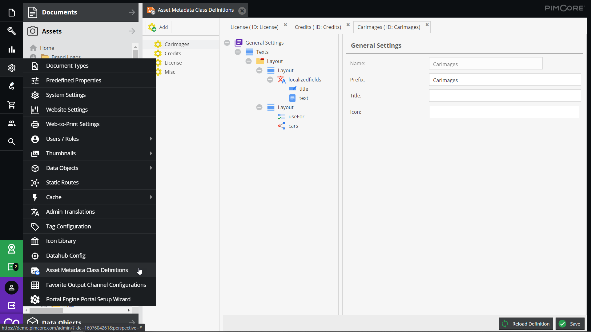
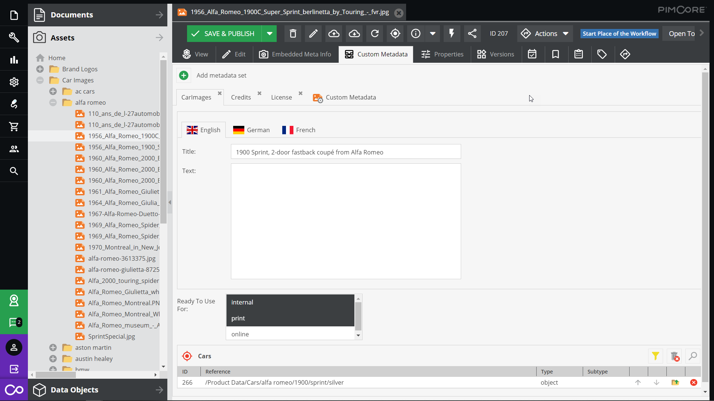

# Enterprise Metadata Bundle

This extension adds Enterprise Metadata with data object like editor and 
additional data types for asset metadata to Pimcore. 

## Features in a nutshell
* Introduces data object like visualization of asset metadata.
* Definition of asset metadata structure in asset class definitions (similar to class definitions).
* Each asset can have assigned multiple asset metadata class definitions.
* Additional data types like multi-select, many-to-many relation, calculated values and many more.
* Storage of asset metadata is the same as with standard asset metadata.

## Asset Metadata Definition

> Required Permission: `classes`. 

See [System Permissions](https://pimcore.com/docs/6.x/Development_Documentation/Administration_of_Pimcore/Users_and_Roles.html) for details.

 

## Asset Metadata Editor

 

