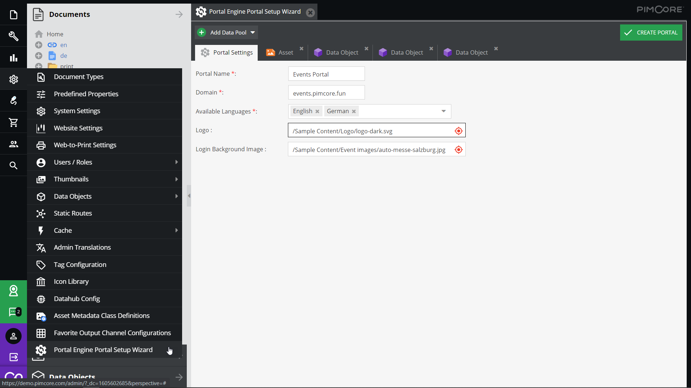

# Configuration Wizard

The portal engine ships with a wizard to support with initial portal setup. It helps to create the initial document
structure and setting the most important settings for the portal and each added data pool. Thus, it is highly 
recommended using it for starting a new portal.  

Once the wizard created all the documents, detail configuration and modification can be done directly in the created 
documents. 

The wizard does not support reopen and modifying existing portal configurations.  
