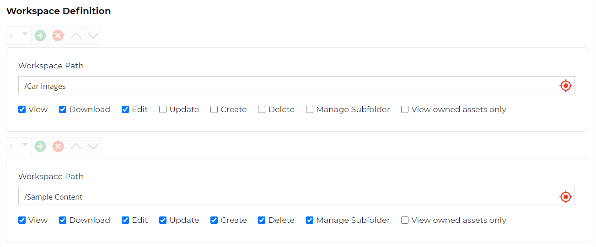
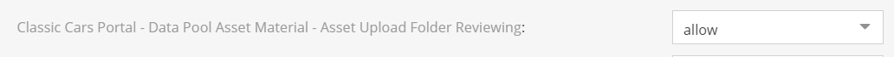
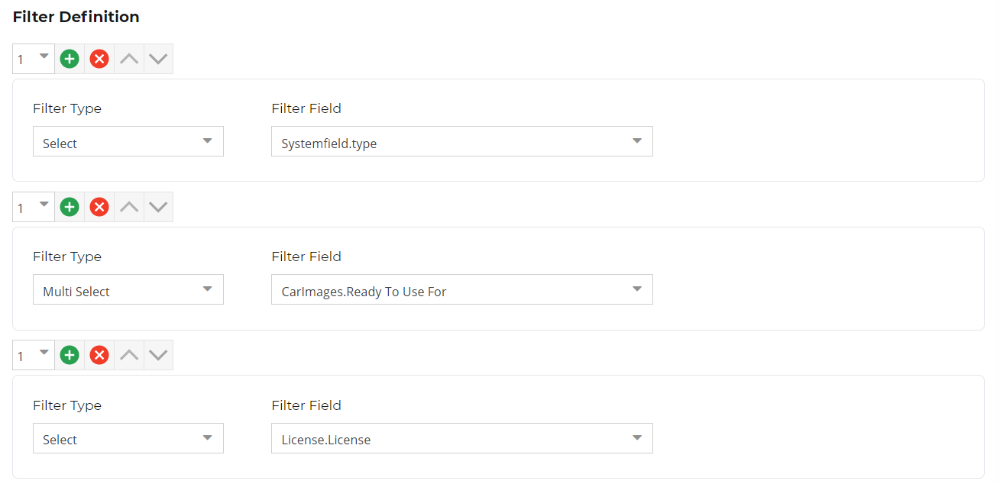
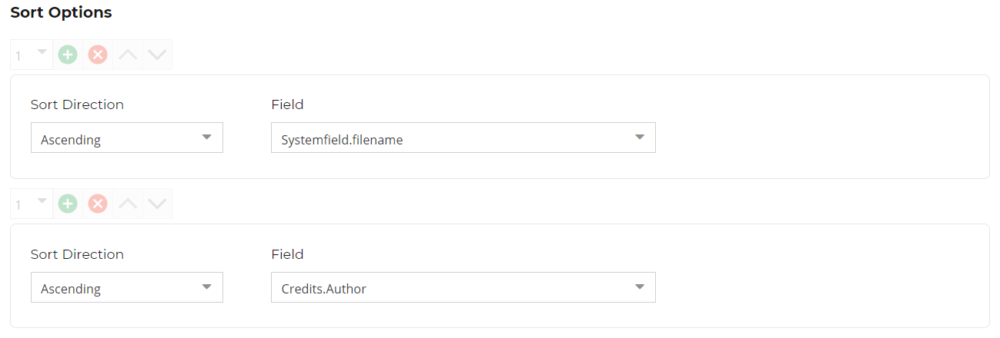
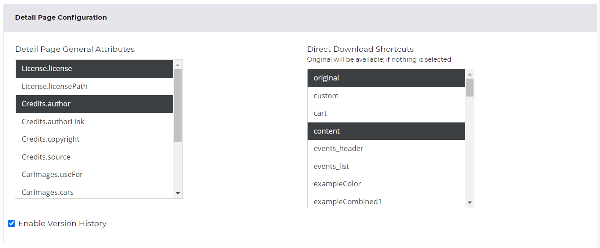
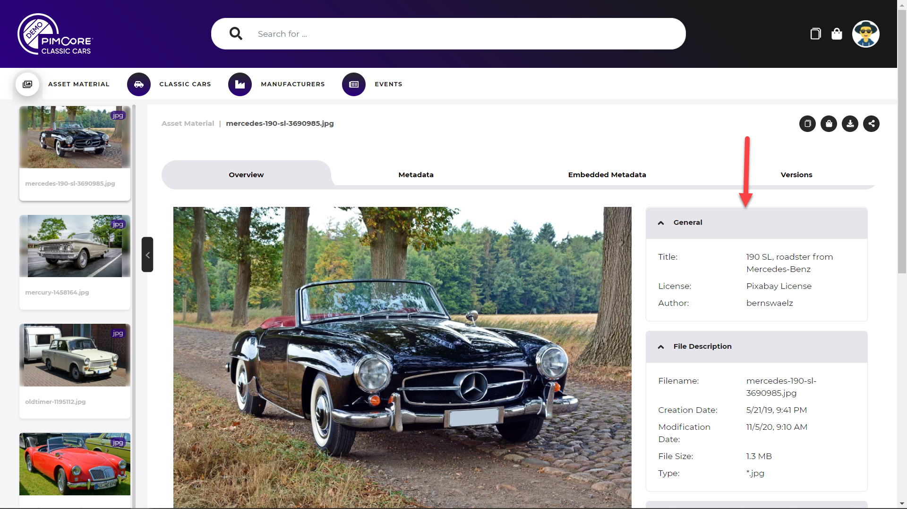
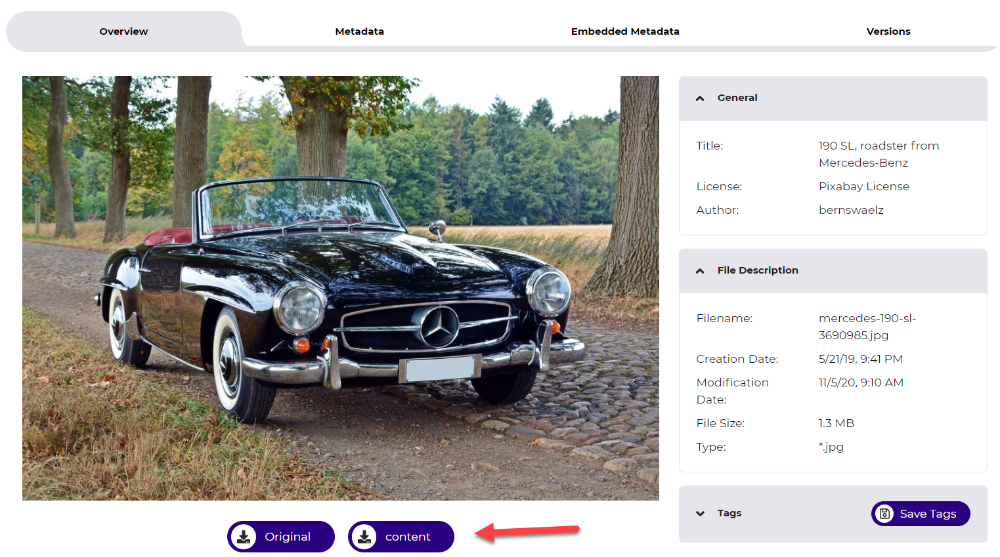
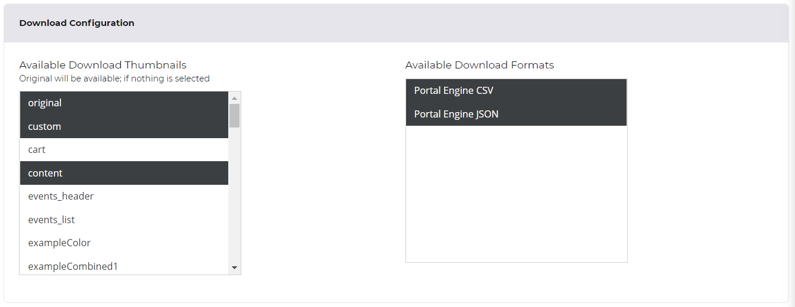
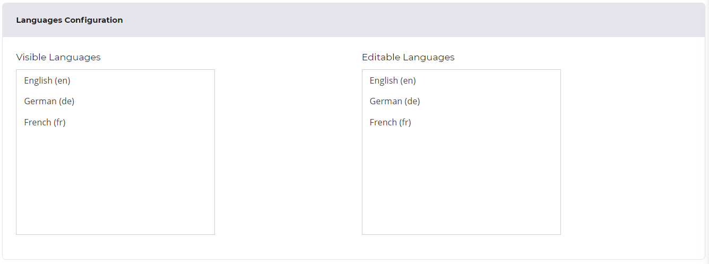

# Asset Data Pool

The asset data pool allows integrating Pimcore assets into a portal. Configurations are available for the grid 
and the detail page. 

### Grid Configuration

#### Workspace Definition	

The workspace concept similar to the workspace concept for defining permissions of Pimcore backend users. Workspaces
define the visible content and what operations should be allowed for the data pool. The definition is based on folders, 
by default nothing is visible.
 

###### Available permissions
- View: Display assets.
- Download: Allow downloading assets and their metadata.
- Edit: Allow editing metadata of assets.
- Update: Allow updating binary data of assets and relocating asset into another folder.
- Create: Allow creating new assets (= upload new assets). Target folders for relocate action need create permission too.
- Delete: Allow deleting assets.
- Manage Subfolder: All creating, renaming and deleting sub folders. 
- View-owned-assets-only: Only show assets that the current user is owner from.  

Permissions are always valid for the defined folder and all its sub folders unless defined otherwise.

#### Pre Condition Service
The pre condition service is a custom extension point that allows further restricting displayed assets of the data pool.
Services can be added with custom services, see [PreCondition Service](../../../15_Development_Documentation/15_Customize_and_Extend_Behavior/11_PreCondition_Service.md)
for details. 

#### Upload Folder	
For detailed description of the upload folder feature see 
[Upload Folder](../../../10_User_Documentation_for_Portals/10_Asset_Features/20_Upload_Folder.md).

Define the upload folder for this data pool by assigning an asset folder. As soon as a folder is assigned, the upload 
folder feature is activated. The asset folder doesn't have to be
part of the data pool workspace definition, necessary permissions are applied implicitly.

In addition to the upload folder setting, users have to have permissions on the assigned asset folder: 
- Standard users who should see only assets uploaded by themselves: 
  Add upload folder to user workspaces and give all permissions. `View owned assets only` is set automatically. 
- Reviewing users who should see all assets: 
  Add upload folder to user workspaces and give all permissions and set `Asset Upload Folder Reviewing` permission of data pool to `allow`.

#### Navigation Options
Define what navigation options show be available for asset grid: 
- Activate / deactivate folder navigation for grid.
- Activate / deactivate tag navigation for grid:
  - Optionally define root tag from which tag tree should be built from.
  
#### Filters
Define available filters for data pool based on
  - Asset metadata attributes: all simple attributes of enterprise metadata definitions are supported.  
  - Asset system attributes: selection of system attributes are available.

As filter types, single select and multi select filters are available. 
  

#### Sort Options    
Define fields and direction for sorting options available to the user in grid.

#### Grid Configuration Attributes
Define attributes that should be shown in table like view in the frontend. If no attribute is defined, the table like 
view is not available in the frontend.   

### Detail Page Configuration

#### General Attributes
Define list of attributes that should be shown read-only in overview tab of detail page in 'general' section. 

#### Shortcut Downloads on Detail Page
Add shortcut buttons for downloading certain thumbnails directly on detail page (without opening download dialog).  

#### Enable Version History
Activate version history in detail page.

### Download Configuration

#### Available Download Thumbnails
Define available thumbnails for image downloads. 
If `original` is activated, download of original file is possible. 
If `custom` is activated, user can specify thumbnail settings (width, height, format, quality) on-the-fly when downloading assets.

#### Available Download Formats
Available data formats for downloading asset metadata. Available formats can be extended with custom services, see 
[Data Exporter](../../../15_Development_Documentation/15_Customize_and_Extend_Behavior/06_Data_Exporter.md) for details. 

### Languages Configuration

Define visible and editable languages for content (respects content in metadata fields). The settings can be further restricted
on user level. Once forbidden, user doesn't see the language (or is not allowed to edit it). 

Empty means that all languages are allowed. 