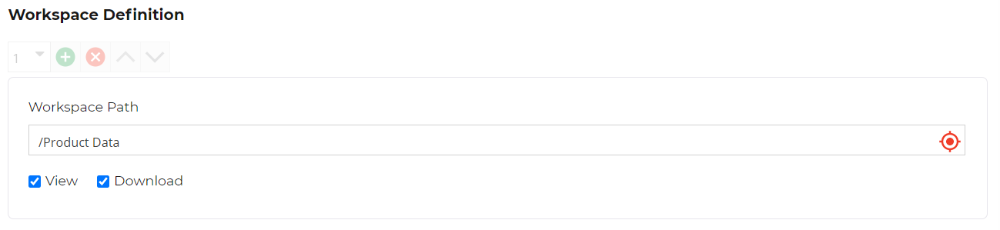
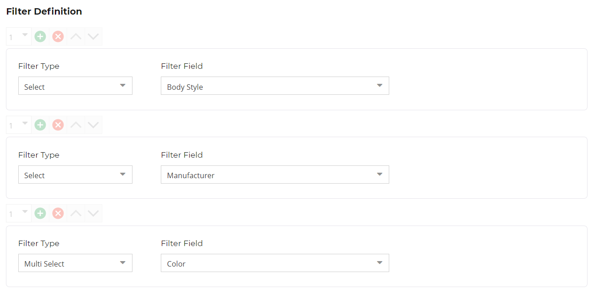
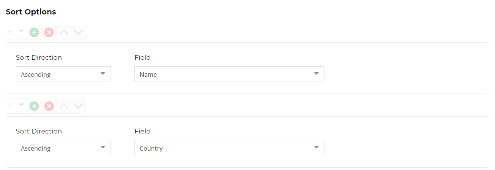
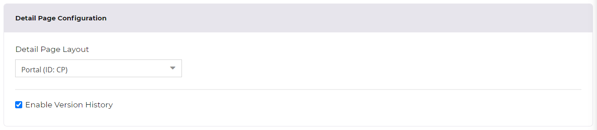
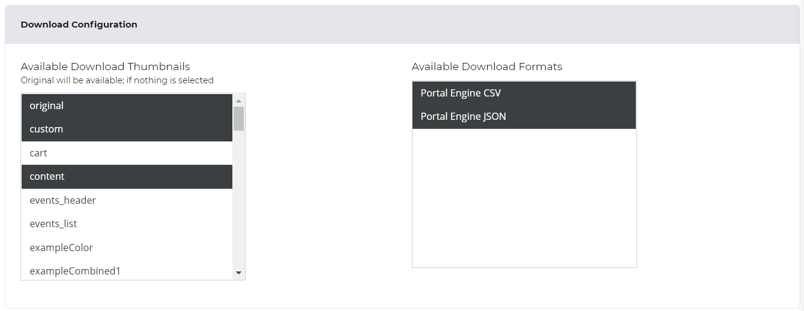

# Data Object Data Pool

The data object data pool allows integrating Pimcore data objects into a portal. Configurations are available for 
the grid and the detail page. 

### Data Object Class
One data pool can display data from one data object class. 

### Grid Configuration

#### Workspace Definition
The workspace concept similar to the workspace concept for defining permissions of Pimcore backend users. Workspaces
define the visible content and what operations should be allowed for the data pool. The definition is based on folders, 
by default nothing is visible.
 

##### Available permissions
- View: Display data objects.
- Download: Allow downloading data objects and related assets.

#### Pre Condition Service
The pre condition service is a custom extension point that allows further restricting displayed data objects of the 
data pool. Services can be added with custom services, 
see [PreCondition Service](../../../15_Development_Documentation/15_Customize_and_Extend_Behavior/11_PreCondition_Service.md)
for details. 

#### Navigation Options
Define what navigation options show be available for data object grid: 
- Activate / deactivate folder navigation for grid.
- Activate / deactivate tag navigation for grid:
  - Optionally define root tag from which tag tree should be built from.
  
#### Filters
Define available filters for data pool based on simple attributes of selected data object class. Fields of following
data types can be filtered: 
- text fields
- number fields
- selection fields
- calculated value
- date fields
- relation fields

As filter types, single select and multi select filters are available. 
  

#### Sort Options    
Define fields and direction for sorting options available to the user in grid.

#### Grid Configuration Attributes
Define attributes that should be shown in table like view in the frontend. If no attribute is defined, the table like 
view is not available in the frontend. Select from all simple attributes of selected data object class.

### Detail Page Configuration

#### Detail Page Layout
Define the [custom layout](https://pimcore.com/docs/pimcore/current/Development_Documentation/Objects/Object_Classes/Class_Settings/Custom_Layouts.html) 
that defines layout of detail page. To add additional custom layouts, just create them in the class editor. 

#### Enable Version History
Activate version history in detail page.

### Download Configuration

#### Available Download Thumbnails
Define available thumbnails for image downloads for related assets of the data object. 
If `original` is activated, download of original file is possible. 
If `custom` is activated, user can specify thumbnail settings (width, height, format, quality) on-the-fly when downloading assets.

#### Available Download Formats
Available data formats for downloading structured data object data. Available formats can be extended with custom services, see 
[Data Exporter](../../../15_Development_Documentation/15_Customize_and_Extend_Behavior/06_Data_Exporter.md) for details. 

### Languages Configuration

Define visible languages for content (respects content in localized fields). The settings can be further restricted
on user level. Once forbidden, user doesn't see the language. 

Empty means that all languages are allowed. 