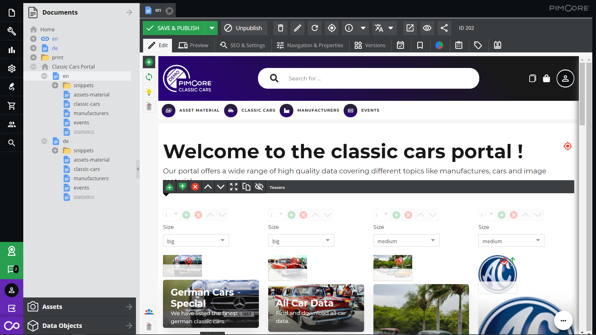

# Dashboard and Content Pages

Content pages as well as the dashboard page are standard Pimcore documents. Their content structure and content 
itself can be populated with area bricks and all the standard concepts known from the Pimcore documents.

Content pages can be added everywhere it the portal - they can be part of the main navigation as well as any sub pages
or even hidden pages that are only reachable via teasers and other links.

### Available Area Brick
The portal engine ships with a list of out-of-the-box area bricks which can be added to any content page: 
- **Teaser CTA**: Full-with teaser with a headline and text on one side, big image on the other side. 
- **Teaser**: Small and medium teasers with background image, headline, sub-headline and a link. 
- **WYSIWYG Text**: Standard wysiwyg text.
- **Statistics Container**: Select one of the predefined statistics to add it to the page.  

### Extend Area Bricks
It is easily possible to add additional area bricks for extended layout and content possibilities. 
See [Add Area Bricks](../../15_Development_Documentation/15_Customize_and_Extend_Behavior/09_Add_Area_Bricks.md) for details. 

