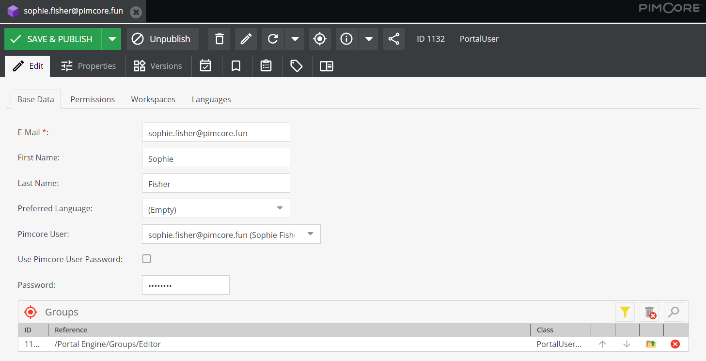

# User Management

Users and their permissions are managed via Pimcore data objects of type `PortalUser`. Each user has a couple 
of base data attributes, assigned user groups and permission, workspace and language settings. 
 
<div class="image-as-lightbox"></div>




#### Base Data
Base data attributes are e-mail, firstname, lastname and preferred language for the portal frontends. The e-mail
address is also the username, all the other attributes can be updated in the profile page of the portals.  

#### Assigned Pimcore User and Authentication
Each portal user has a Pimcore user assigned - either the `portal-engine-default-user` or a dedicated user. When creating 
a new `PortalUser`, the `portal-engine-default-user` is assigned automatically. To assign a dedicated Pimcore backend user, 
the user has to be selected manually. 

The link between portal users and Pimcore backend user is necessary for a couple of things: 
- **User for assets and versions**: When user creates or updates assets in frontend. 
- **User for workflow actions**: When user starts workflow transitions in frontend. 
- **Collections in Pimcore Backend**: To show all collections of corresponding user in backend. 

Authentication can be against a password stored in the `PortalUser` object (default behavior, mandatory when 
`portal-engine-default-user` is used) or against the password of the Pimcore backend user (only possible when dedicated 
user is assigned). In this case the authentication is delegated to the Pimcore backend user. 

Besides the password (if activated), no other settings and permissions are used from the Pimcore backend user. 

##### Fields for identifying user

By default the field `email` gets used during login for identifying a user. This can be changed by overriding the following configuration:
```yaml
pimcore_portal_engine:
    login:
        fields:
            - email
            - externalUserId
```
With this configuration a user could be identified by `email` or `externalUserId`.

#### Groups
One user can belong to multiple groups. Groups are other Pimcore data objects of type `PortalUserGroup` and have settings
for permissions, workspaces and languages. 

All settings of all assigned groups are merged with the user settings to a collected permission set for the current user.  
Details on the merging strategy see below. 

#### Permissions
The permissions allow specifying access to portals, data pools and features for the current user. The permission list
is updated based on available portals, data pools and settings. Possible values for each permission are:
- Allow: User is allowed to access.
- Deny: User is not allowed to access.
- Inherit: Inherits permission settings from assigned user groups; merging is done optimistic, means once allowed, it is allowed.

If the user is an admin, it has all permission and access to all folders (all workspace settings for admin users are ignored). 


#### Workspaces
Workspaces define what elements the user has permissions for (to view, download, edit, etc.). The user workspaces are global, 
portal independent and are merged with data pool workspaces. On user level, portal workspace permissions can be further restricted, 
not extended.

By default, users don't have access to anything. At least one workspace entry (or admin permission) is necessary to see
content in the portals. 

See 'Permission Validation Priority' below for detailed information about the permission validation.


#### Language Settings
- Visible Languages: Available languages of content (respects content in localized fields and asset metadata)
  - is merged with settings on data pool level ... once forbidden, user doesn't see language
  - empty means, that all languages are visible
  
- Editable Languages: Editable languages of content (respects content in asset metadata)
  - is merged with settings on data pool level ... once forbidden, user doesn't can edit language
  - empty means, that all languages are allowed
  
  
#### Permission Validation Priority

##### Validation of workspaces and permissions
1) User needs access to portal.
2) User needs access to data pool.
3) Folder/element needs to be included in user workspace definition.
4) Folder/element needs to be included in data pool workspace definition.
5) Data pool permissions (e.g. download allowed, available thumbnails).
6) User level permissions (e.g. download allowed, available thumbnails) → further restrict data pool permissions, but not extend them.

##### Merging rules for group and user objects
- Workspaces
  - Same as for Pimcore permissions
  - Group workspace definitions are merged, once something is allowed, it is allowed
  - Sub folder can overwrite (and restrict) permissions of parent folders
- Other Permissions
  - Merge all group-level permissions → once allowed, it is allowed
  - user-level permissions 
    - allow/deny → use user-level permissions, ignore group permissions
    - inherit → use group-level permissions