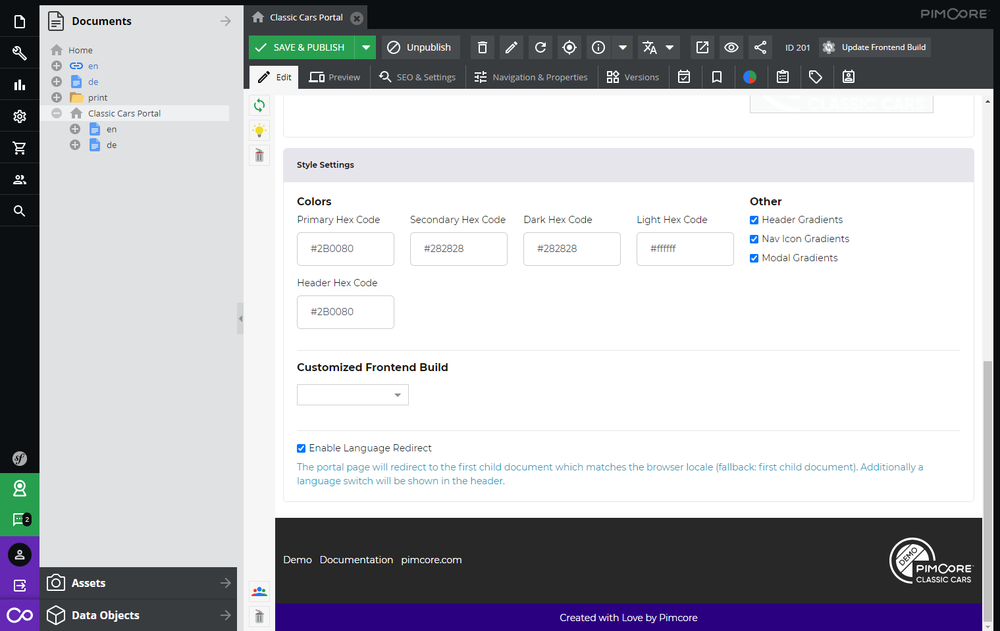

# Styling Settings and Frontend Build

It is possible to customize the styling of portals and thus change their look and feel. 

In this section you will learn how to do this directly in the Pimcore backend. If you are interested into detailed 
customization possibilities via code changes take a look at 
[Customize Appearance](../../15_Development_Documentation/10_Customize_Appearance/README.md) within the development 
documentation.

## Style settings

You will find the style settings within the portal configuration document (root document of the portal engine site).

There it is possible to change certain variables through input fields and checkboxes. To change the styling the following 
steps are needed:

* Change the input values and checkboxes in the "Style Settings" section according to your needs.
* Save the document.
* Press "Update Frontend Build". 

Now the new styling should be visible in the frontend.

### Description of style settings

#### Colors

| Setting       | Description           | 
| ------------- |-------------| 
| Primary Hex Code | main nav icons, primary button stylings, folder navigation, footer bottom bar, ...  (Bootstrap CSS primary color) | 
| Secondary Hex Code | filter background color, loading icons, folder/tags switch border, ... (Bootstrap CSS secondary color) | 
| Dark Hex Code | listing teaser icon buttons, (button) icon colors, footer     | 
| Light Hex Code | listing teaser "open" button, light button,... | 
| Button Primary Text | Text color of primary buttons | 
| Button Secondary Text | Text color of secondary buttons | 
| Button Dark Text | Text color of dark buttons | 
| Button Light Text | Text color of light buttons | 
| Header Hex Code | header background color   | 
| Header Icon COlor | header icon color   | 

 
#### Other

| Setting       | Description           | 
| ------------- |-------------| 
| Header Gradients | Enable/disable gradient in the header | 
| Nav Icon Gradients | Enable/disable gradient for main navigation icons | 
| Modal Gradients | Enable/disable for the title bar of all modal windows  | 
