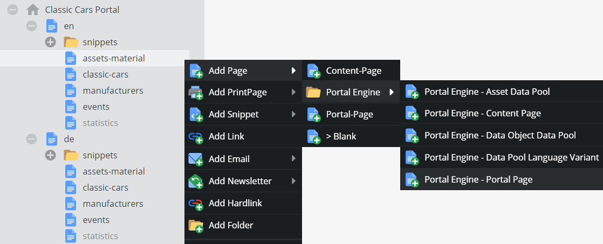
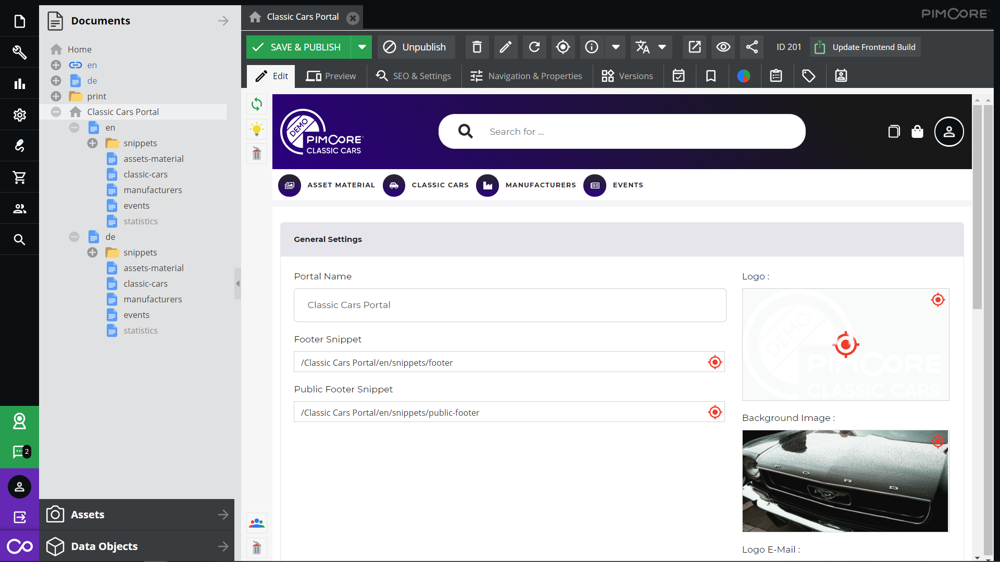
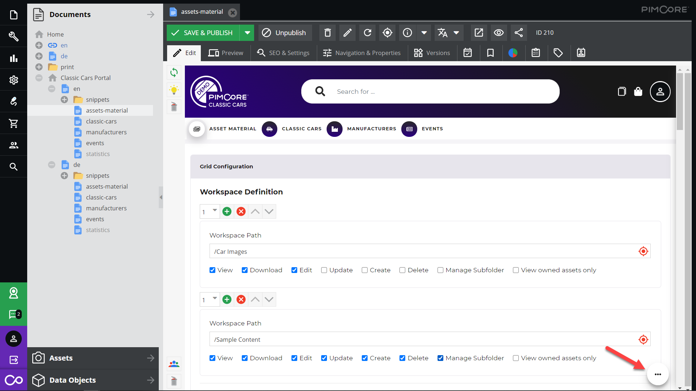

# Configuration

The configuration of the portals takes place in Pimcore documents. Each portal is defined as a Pimcore site and 
configuration documents within this site define structure and content of the portal.  

## Portal Structure 
As with any other Pimcore application, the documents tree defines URL structure and navigation of the portals. 

There are a couple of predefined document types to set up portals, dashboards, standard content pages and data 
pools (see below).

The portal page document defines a couple of portal-wide configurations like 
- Portal name: Name of portal used in different places.
- Logo: Logo of portal used in header, footers and e-mails. 
- Background image for login page
- Footer: Footer for the portal configured as Pimcore document snippet. 
- Style Settings: Settings to customize styling like colors and gradients. 
  See [Styling Settings and Frontend Build](./30_Styling_Settings_and_Frontend_Build.md) for details. 

Depending on weather the portal is single language or multi language, the portal page also defines the content of the 
dashboard page of the portal. See [Dashboard and Content Pages](./11_Dashboard_and_Content_Pages.md) and  
[Multi Language Portals](./15_Multi_Language_Portals.md) for details.  

Every main navigation page can have an icon, which can be configured in the document itself in the bottom-right corner.
 

A portal runs as a site with its own domain. The own domain is necessary for clean login and symfony firewall handling.   

## Data Pools
Data pools define the displayed content of the portal. There are two basic types of data pools:
- [Asset Data Pools](./10_Data_Pool_Configurations/02_Asset_Data_Pools.md): Allows displaying Pimcore assets in 
  the portal. 
- [Data Object Data Pools](./10_Data_Pool_Configurations/04_Object_Data_Pools.md): Allows displaying Pimcore data objects
 in the portal. 

Each data pools has a grid and detail pages for the content. Depending on data pool type, settings and user permissions
different features are available. Workspaces define what actual elements should be 
displayed in the data pool. See the configuration detail pages for details. 

Data pools are most likely located in the top navigation level, but it is possible to place them anywhere in the 
portal document tree. A portal can have multiple data pools.
