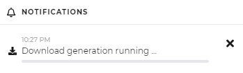

# Background Processes

The following processes in the portal engine frontend are are executed by 
[Symfony messenger workers](https://symfony.com/doc/current/messenger.html) as background processes.

* Download zip generation
* Batch asset deletion 
* Batch asset relocate
* Batch update metadata

In the frontend you will recognize them via progress bar notifications at the bottom right of the browser window.

<div class="image-as-lightbox"></div>



It is needed to have at least one permanently running worker up and running. 

```bash
php bin/console messenger:consume
```

Depending on how many parallel frontend users you have in your system, it is recommended to start 
multiple of them (for example 4) as otherwise the users within the frontend maybe 
need to wait quite a lot of time until there ZIPs are generated or other processes are handled.

As PHP is not ideal for long running processes and the workers might crash from time to time
or would consume a lot of memory if running for a long time it is recommended to use 
some kind of process control system to ensure that the workers will stay up and running.

Supervisor should be the right tool here but it is up to you how to setup it and there are 
several other possibilities and tools out there. 

The [Symfony messenger documentation](https://symfony.com/doc/current/messenger.html#supervisor-configuration) explains 
how to setup supervisor. 

The [Deploying to Production](https://symfony.com/doc/current/messenger.html#deploying-to-production) section should also 
be read carefully.
