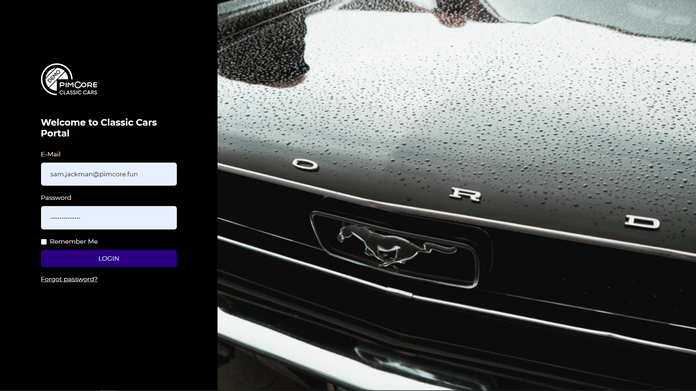

# Login

Before using any portal created with the portal engine, users have to login into the system.

Users are created and configured with Pimcore data objects and can have different feature, portal and data access 
permissions. For details see the [user management](../../05_Administration_of_Portals/05_Configuration/20_User_Management.md) 
in the administration part.

User [profile page](./27_Users_and_Profile.md) and password recover functionality exist in every portal.  
