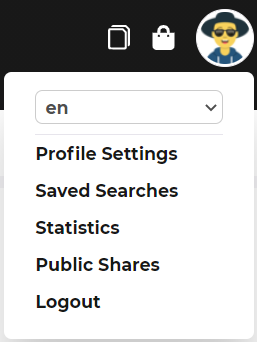
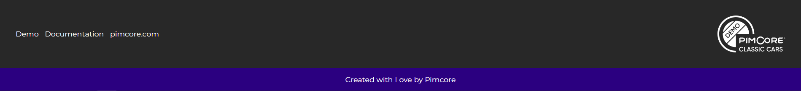

# Structure and Navigation

The portal header contains a [configured portal logo](../../05_Administration_of_Portals/05_Configuration/README.md),
the [global search](./06_Search.md), the main menu, icons to open [collections](./18_Collections/README.md) and 
[download cart](./15_Download_Cart.md), and a profile menu. 

## Main Menu
Entries of the main menu are part of in the [portal configuration](../../05_Administration_of_Portals/05_Configuration/README.md) 
and most likely contain links to all data pools available in the portal. Additionally, the main menu also can contain 
additional content pages and subpages for each main entry. 
  
## Profile Menu
The profile menu contains links to additional features and settings for the user. It also contains a language switch
in case of a multi language portal. 

## Footer

The footer is also part of the portal configuration and contains additionally configured links and the configured portal 
logo. 