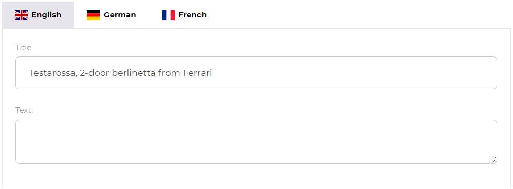

# Multi Language Portals

In terms of multi language there are two aspects to be considered: 

## Multi Language Portal Frontend
The frontend of a portal - that contains all menu entries, buttons, labels, content pages etc.) - can be multi language. 

For the login page, the language is detected based on browser settings, for the portal itself there is a language 
switch in the profile menu and each user cat set a preferred language.  

## Multi Language Content
Content visible in the portal (assets and data objects) can contain multi language content like multi language metadata
or data in localized fields. This content is shown in all languages configured on data pool and/or user level independent 
of the current portal frontend language. 

Details see also [multi language portals](../../05_Administration_of_Portals/05_Configuration/15_Multi_Language_Portals.md) 
in administration section. 

