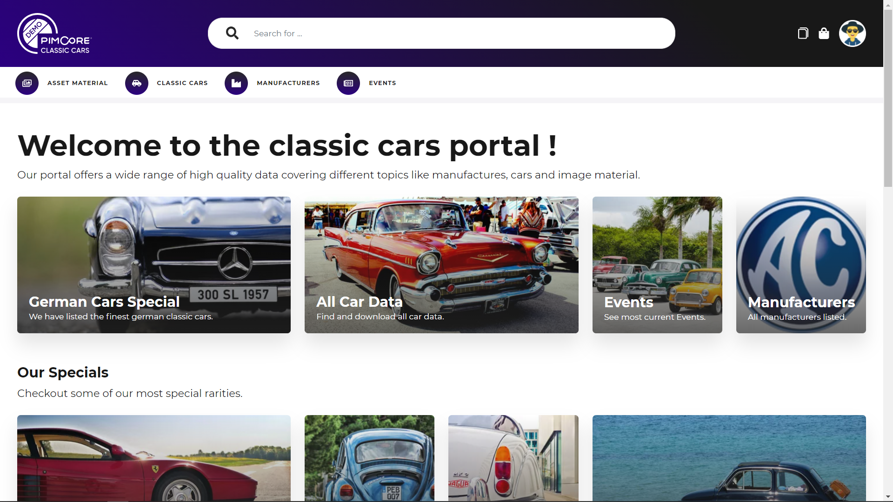

# Dashboard and Content Pages

The dashboard page gets configured per portal and language, and contains editorial content for the corresponding 
portal. Additional editorial content can be added with content pages allover the portal.  

Dashboards as well as additional content pages are defined in 
[portal configuration](../../05_Administration_of_Portals/05_Configuration/11_Dashboard_and_Content_Pages.md) and 
can be composed with a set of area bricks in the typical Pimcore way.      