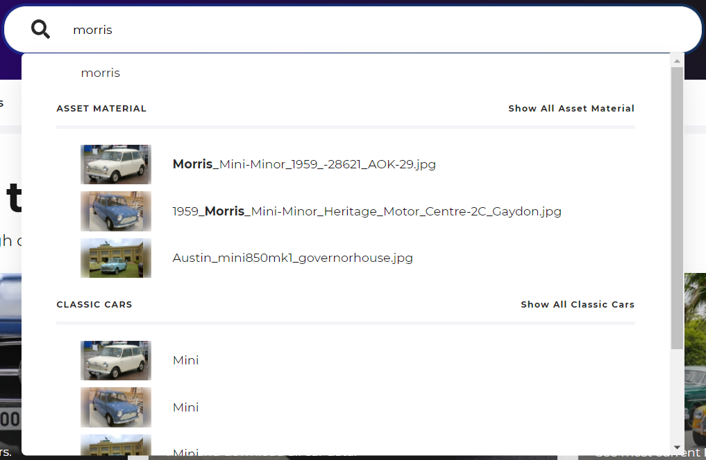
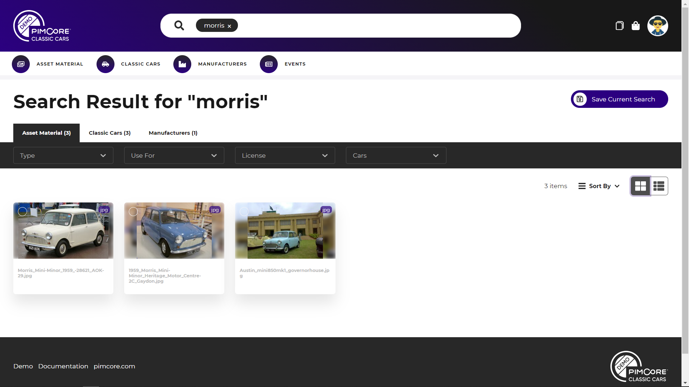
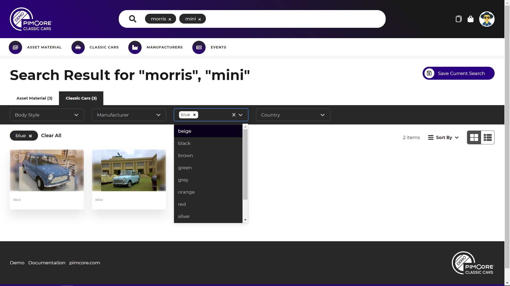
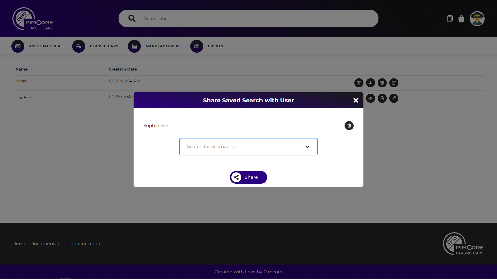

# Search 

Each portal has a powerful fulltext search powered by Elasticsearch. It searches for given search terms in all 
content that is available in any of the data pools of the portal. The search comes with an auto-suggest type-ahead 
feature as well as with an extensive search result page. 

The fulltext search always searches in all content of all languages.

### Auto-suggest Type-ahead

As soon as typing starts in search field, the auto-suggest of search results appears. It contains results of all data 
pools and shows preview image as well as name of the element. Clicking on one element (or navigating with keyboard and
pressing enter) opens detail page of the corresponding element. 

### Search Result

Pressing enter without selecting an element in auto-suggest overlay opens the search result page. 

 

The result page shows results in a tabbed view with one tab for each data pool that has results for the current search. 
Each tab shows the grid/list view of the corresponding data pool with all filters and features (like selection, 
download, adding to collection and cart, etc.).

##### Search within Result Set

When search result page is active, additional search terms can be added by just clicking into the search field and
typing. Then the search is further narrowed down according to the search terms. 

 

Also, further filtering in the search result of every data pool is possible based on the available filter attributes. 

##### Saving & Sharing of Searches

The saving search feature saves all search terms, active data pool and filters for later re-use. Saved searches are
listed in the saved search list, can be executed from there again and can be shared with other uses too. 

 
