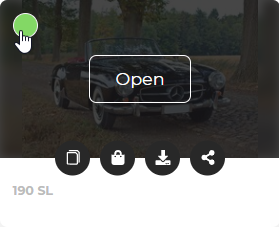
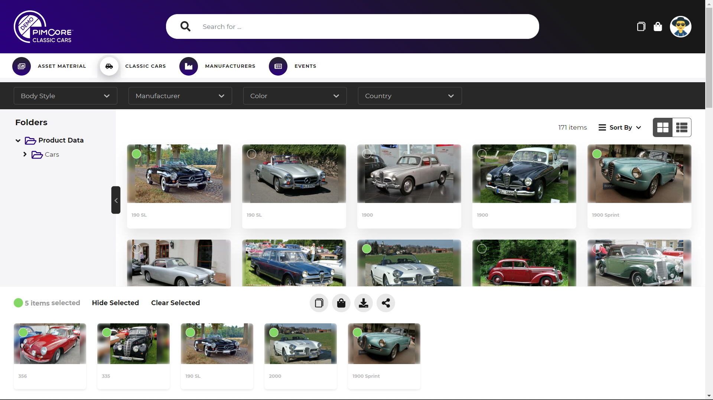

# Multi Selection

All listings of data pools support multi selection. 

A multi selection bar at the bottom of the screen shows all selected items and offers a couple of actions that can 
be applied to the selected items - depending on data pool type and user permissions. 

The selection is stored per data pool and context (grid, collection, search result) and remains (except in search result) 
after page reload / page switch, filter change, folder change, etc.  
