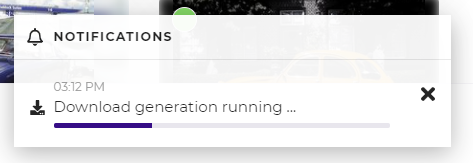
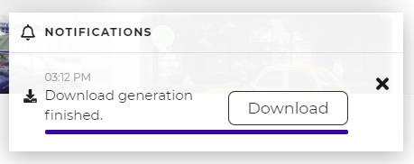
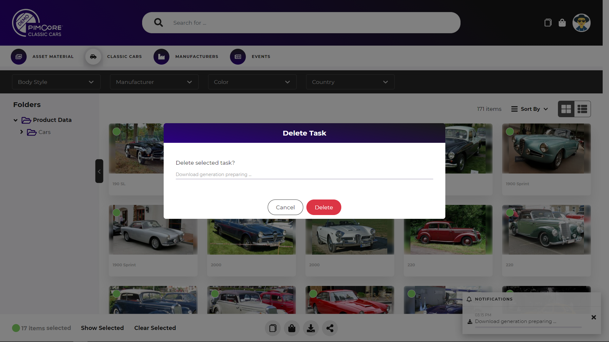

# Background Tasks and Notifications

Various actions in the portals like batch updating, batch downloading etc. result in long-running processes. The portal
engine executes these long-running processes asynchronously in the background and notifies the user about progress
and when the tasks are finished. 

Depending on the task type, a call to action button is available when task is finished. 

It is also possible to cancel a long-running task by clicking the x in the notification. 

 
