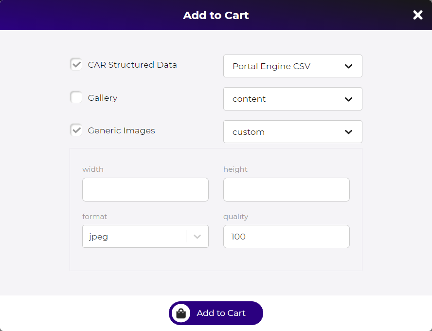
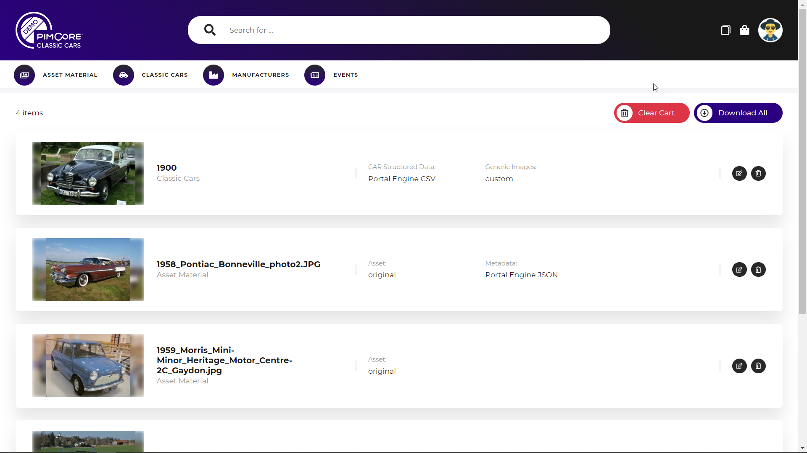

# Download Cart

The download cart allows collecting multiple items of different data pools and download them together in one zip file. 
Each user has one download cart per portal, and the items also remain in download cart after logging out of the portal. 
 
### Download Cart Items
All data elements shown in a portal can be added to the download cart. When adding a data element to the download cart, 
a download cart item gets created. Each download cart item contains the element itself (e.g. asset, data object) and 
additional settings that are specified when adding the elements like: 
  - Format of structured data export
  - Thumbnail of images
  - For data objects: linked assets and their thumbnail that should be included into the download
 
 

 
  
  
### Download Cart Listing

  

The download cart listing shows all items added to the cart and allows to manage them. 

##### Edit download cart items
Edit settings of download item by opening the 'add to download cart' dialog of corresponding data pool and modify
settings like download formats and included data. 

##### Remove download cart item
Remove download item from download cart. 

##### Execute download
Creates a ZIP file with all items respecting their settings and offers it to download. The ZIP file is generated in
a background task. 

  

  
> The prepared download gets cleaned up on the server after the download has finished or when user deletes the 
> finished notification.  

