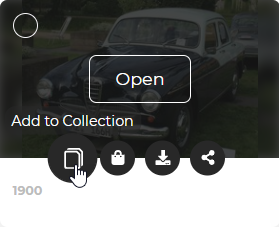
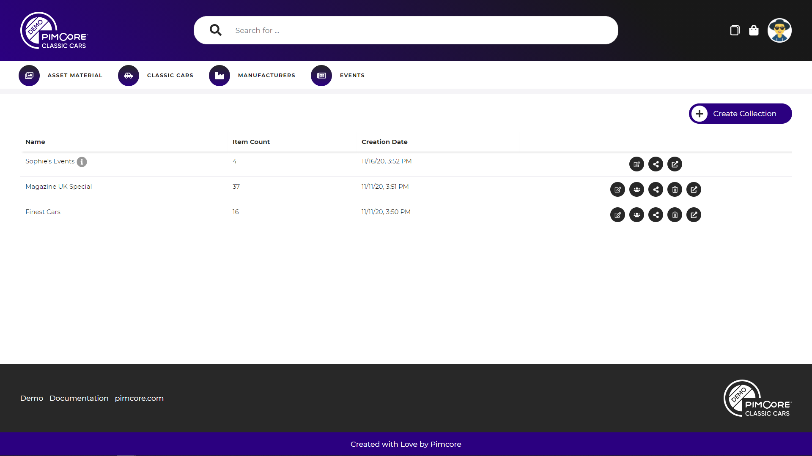
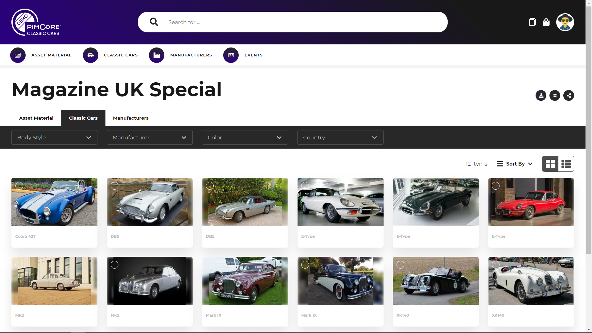
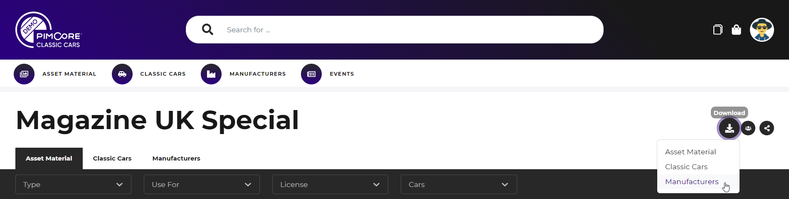
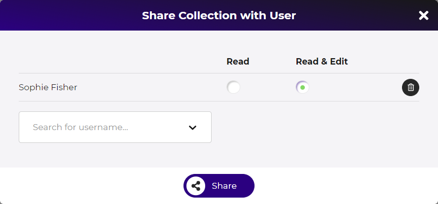
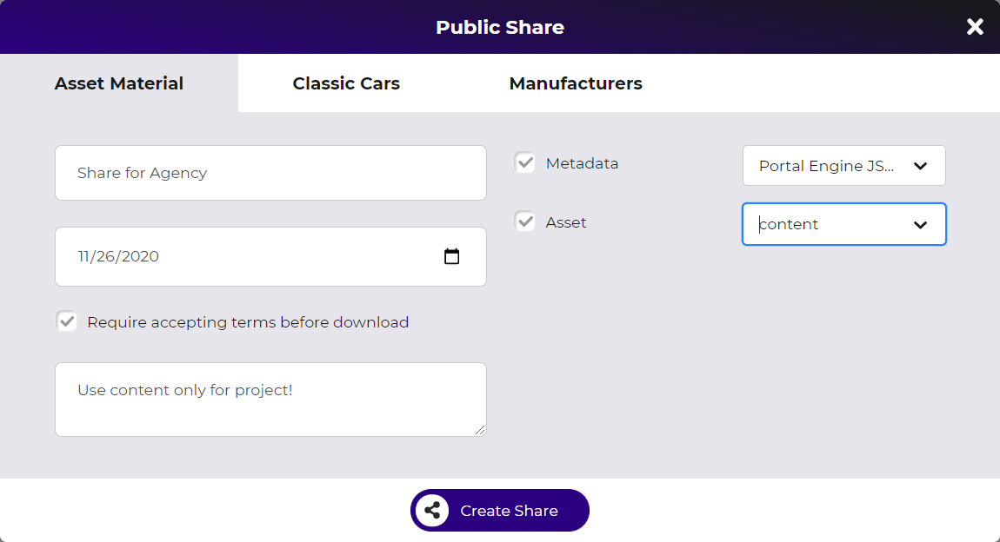

# Collections in Portal Frontends

Portal frontends fully integrate collections and thus they are an essential part of every portal. 

### Add Elements to Collection

Elements can be added to collections in multiple contexts like in listings, detail pages, search results, etc.

The 'add to collection' dialog allows to select an existing collection or create new a collection on-the-fly to add
the element(s) to. Just start typing collection name in the collection field. 

### Manage Collections
The portal header contains a link to the collection listing which shows all collections of the current user.
That are collections created by the current user, and collections shared with the current user. 

The collection listing offers actions like creating new collections, and editing, opening, sharing and deleting existing
collections. 

### Collection Detail Page

The collection detail page shows all elements assigned to the collection in listings based on their data pools. 
Thus all listings have all the features available in the data pools to - like filtering, multi selection, adding to 
cart, adding to another collection, batch editing, etc. 

Possible restrictions: 
  - Elements that are not visible for user due to permissions are not shown in collection detail page.
  - Elements that are in collections but not visible in any data pool are not shown in collection detail page.
  
##### Collection Download

Collections allow to download all assigned elements in one ZIP per data pool.

Again, download settings for download formats and included can be specified and the ZIP get packed in a background
task.  

### Sharing

Collections provide two options for sharing. 

##### Sharing with other portal users

Collections can be shared with other portal users two options: 
- Read only: Users can open collection, but NOT edit it and add/remove elements.
- Edit: Users can open collection, edit it and add/remove elements.

Changes of collection items (newly added, removed) are updated for all users right away. The sharing options can be 
edited any time. 

##### Public sharing
Collection also can be shared via the [public sharing](../21_Public_Sharing.md) feature. If a collection is shared
via public share, updates of the collection items (newly added, removed) are also updated to the shares. 

