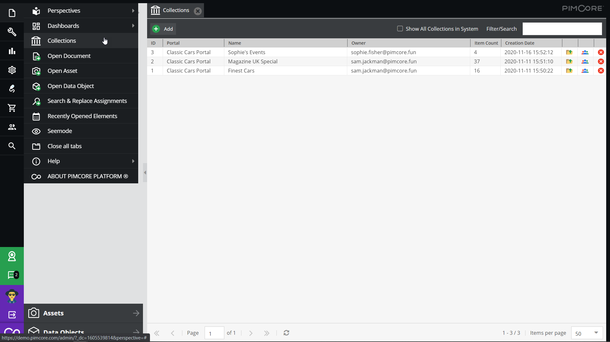
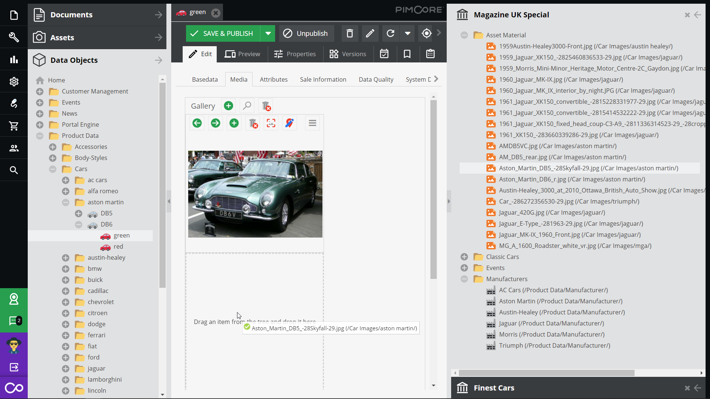

# Collections in Pimcore Backend

Collections are also accessible in Pimcore backend. Thus, it is possible to manage collections and use collections
as source and destination for drag & drop operations like creating relations or adding elements to collections.    

### Prerequisites
There are two prerequisites to make collections work in Pimcore Backend
- There has to be a link between portal users and Pimcore backend user. 
  See [user management](../../../05_Administration_of_Portals/05_Configuration/20_User_Management.md) for details. 
- The Pimcore backend user needs `Backend Collection Access` permission. 

### Manage Collections

The collections list is located in the file menu and provides following features: 
- List all collections of user
  - own collections
  - shared collections
- Create and delete collections
- Open collection as element tree in Pimcore

- Collections can be shared with other Pimcore Users
  - Read only
  - Edit

- *For admin users*: The option show all collections in system allows to list all collections and thus also find 
orphaned collections and do some collection house keeping. 

### Collection Tree View
Collections can be opened as an element tree similar to custom views: 
- Every data pool of the portal the collection belongs to is one root node of the tree. 
- Elements can be assigned to collections via d&d.
- Elements can be dragged from collections to any relation fields in Pimcore backend user interface.
- Elements that are not visible for user due to permissions are not shown in collection tree view - can happen if collection gets shared by other user.

