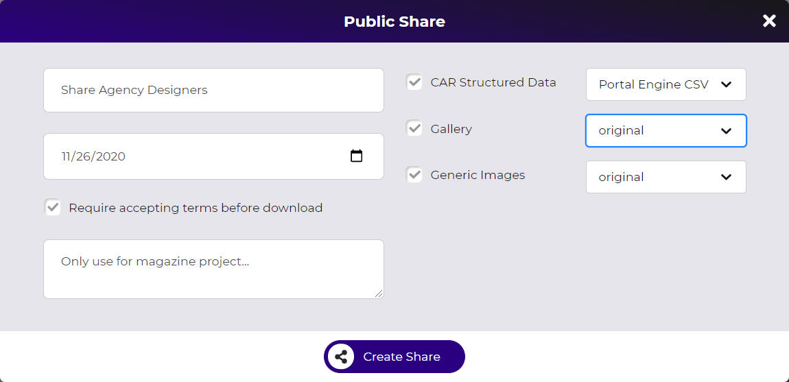
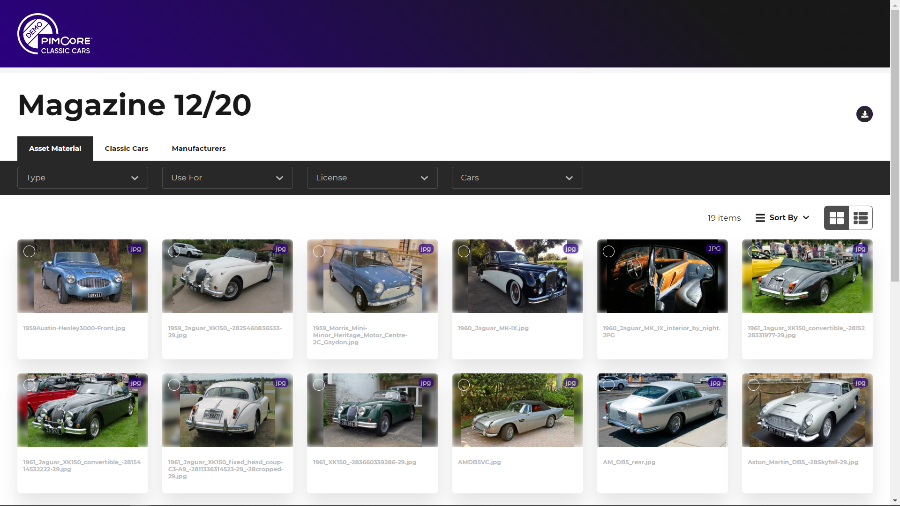
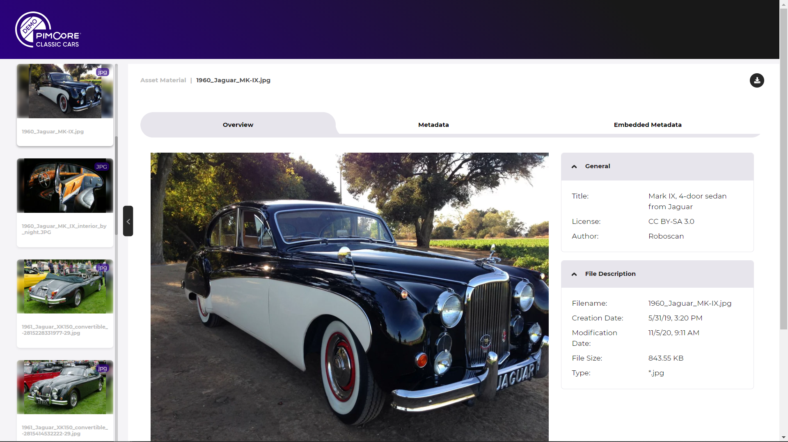
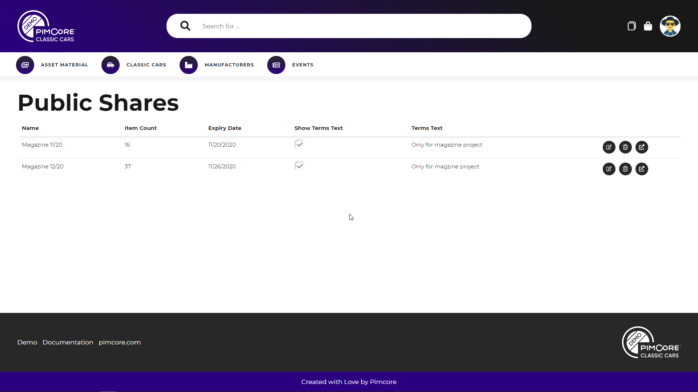

# Public Sharing

The public sharing feature allows sharing one or multiple elements with users that don't have a login for the portal.
These users can access a separate sharing view with a token link and depending on the settings open and download 
the shared elements. 

  
### Create Share

Users can create shares in multiple contexts in the portal with the share dialog. Besides the actual shared elements, 
each share also defines the content format (similar to download cart) and some additional settings like name, 
expiry date etc. 

##### Sharing Dialog
The sharing dialog is available at:
  - Listings (share single element or based on multi-selection) 
  - Detail pages 
  - Collection listing and detail page (for whole collection or single/multi-selection elements)

- Sharing Options
  - Name
  - Expiry date: Define expiry date of share. After date expired, share gets deleted.
  - Require accepting terms before download: if activated an additional terms checkbox is shown before any download is started in sharing view.
  - Content format settings: similar to downloads and download cart

### Sharing View 

The generated token link opens a separate sharing view with listing and detail page without need to login into the 
system. 

##### Listing Page

The listing page shows all shared elements grouped in their data pools similar to the collection listing page. Also, 
all the features like filtering, sorting, multi-selection etc. are available in the listings. 

Each element can be downloaded individually or via multi selection. Additionally, global download buttons for downloading 
all shared elements of a data pool are available. Download buttons are only available if download is permitted for 
the current share. 

##### Detail Page

The detail pages are the same as within the portals with a reduced set of features. 

### Share overview for user
The profile menu provides a list of all public shares of the current user. The list provides options to edit, delete
and open the shares. 

