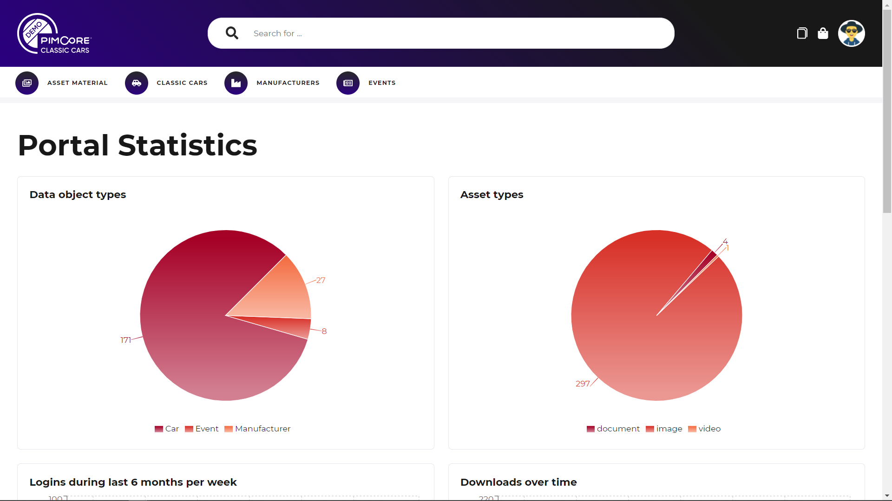
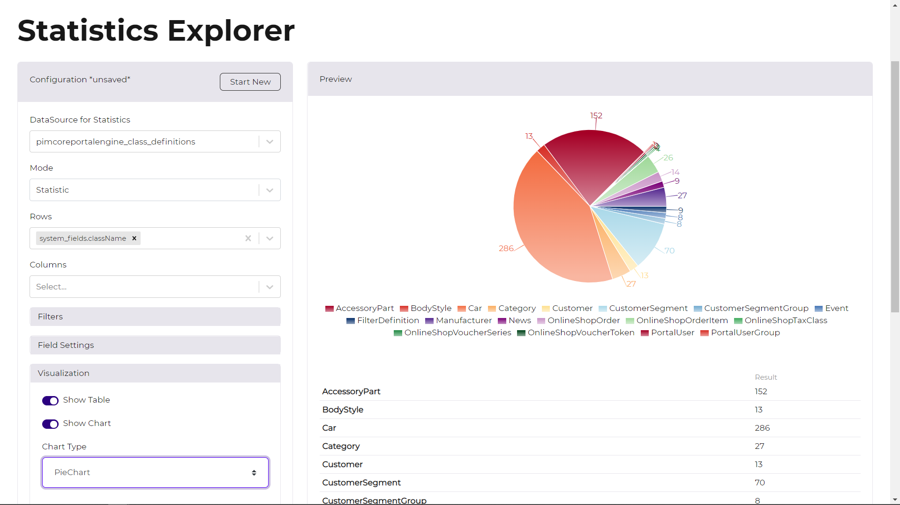

# Reporting and Statistics

### Predefined Statistics

The portal engine ships with a couple of out-of-the-box reports that can be integrated into any content pages via 
area bricks. 

Available predefined statistics are:
- Data object types: Pie chart for an overview of available data object types
- Asset types: Pie chart for an overview of available asset types
- Asset storage per type: Pie chart for an overview of asset types and their used storage space
- Logins during last 6 months per week: Line chart of all logins happened during last 6 months
- Downloads over time in total: Line chart of all downloads happened during last 6 months
- Downloads over time by context: Line chart of all downloads happened during last 6 months per download context
- Most downloaded assets
- Most recent downloads of current user
- Most recent updates
- Most recent updates of current user

These statistics are pre-filtered for all user permissions of the current user. 

### Statistics Explorer

In addition to the predefined statistics, the portal engine ships with a statistics explorer that allows on-the-fly 
deep-dive analytics. 

Available data sources are
- Assets Index
- Assets Updates
- DataObject Class Definitions
- Downloads
- Portal Logins
- Data Objects (for all Data Object Classes available in at least one data pool of current portal)

For details also see [Statistics Explorer Documentation]()