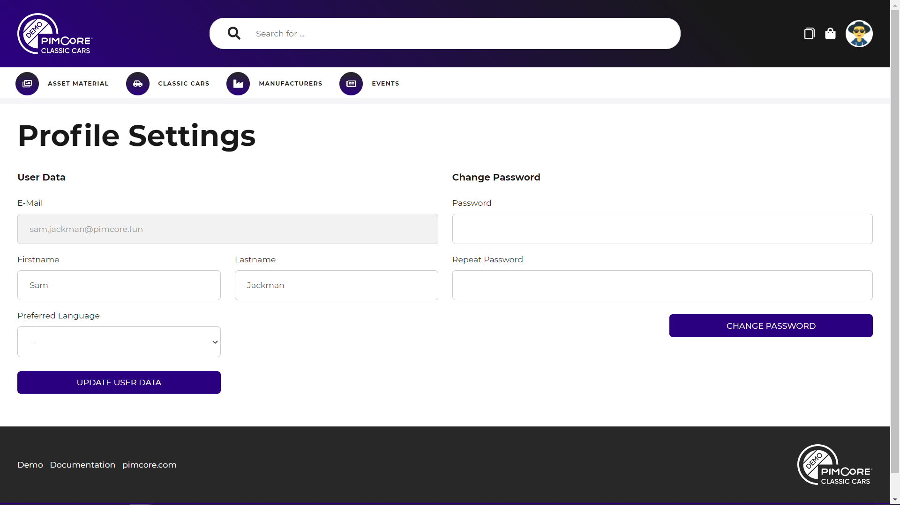

# Users and Profile

### Profile Page

The profile page provides possibilities to change user data and password. 
The preferred language defines, which language version of multi-language portals should be used by default.  

### Reset Password 
The login page offers a reset password feature. An e-mail with a token link is sent to the
defined e-mail address of the given username. This token link allows to login into the portal and sets a new
password. 
