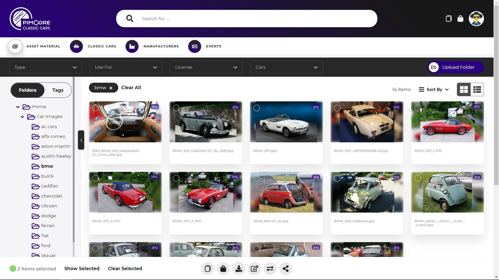
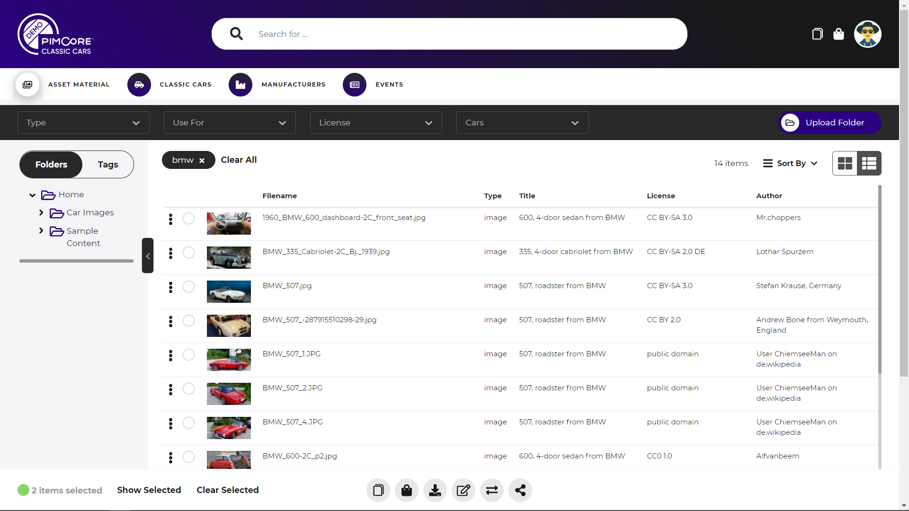
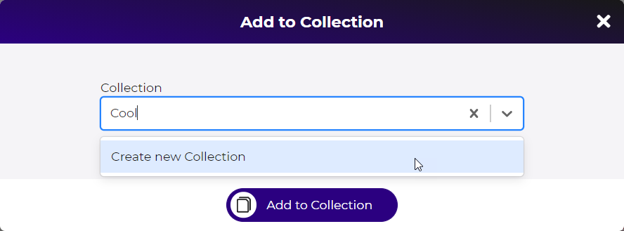
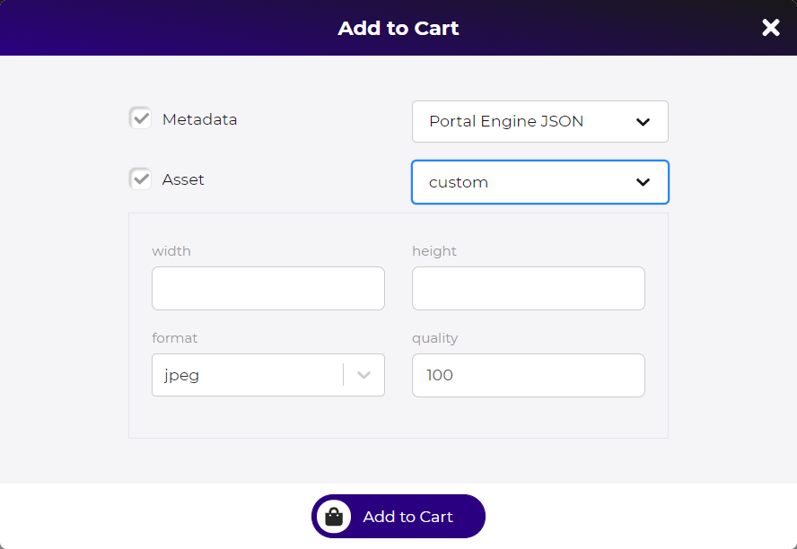
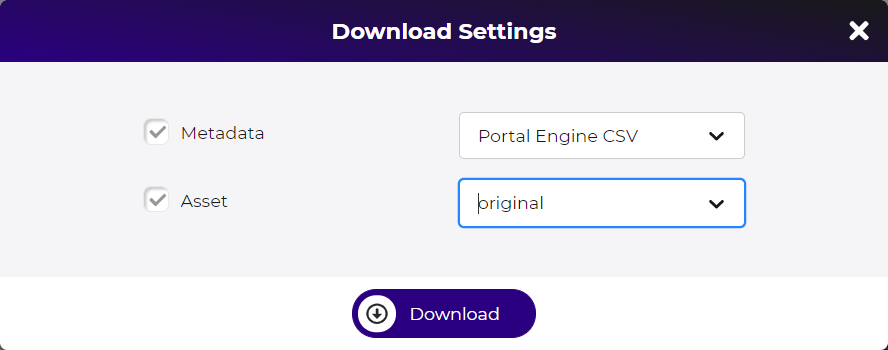
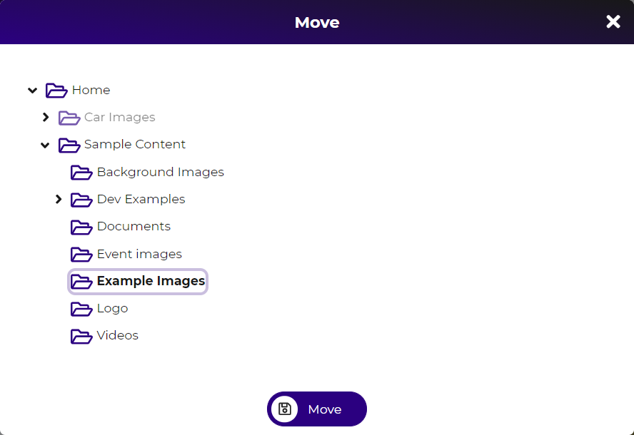
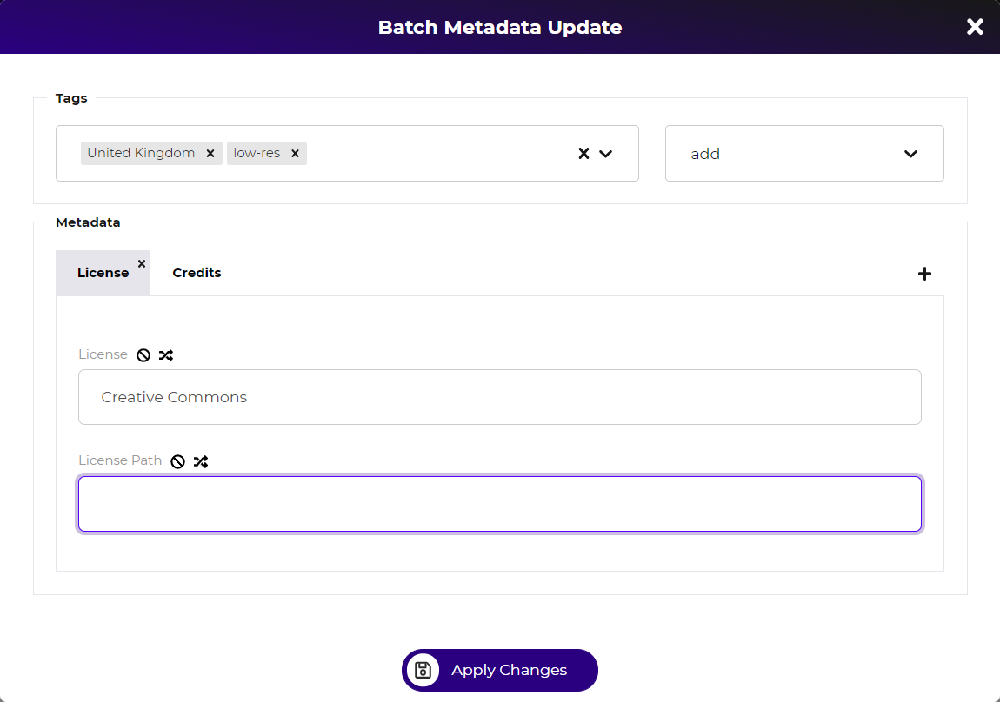

# Asset Grid

Asset grids are used for all asset data pools in the portals. The actual available 
features of the asset grid depend on the configuration of the asset data pool. 
See [asset pool configuration](../../05_Administration_of_Portals/05_Configuration/10_Data_Pool_Configurations/02_Asset_Data_Pools.md) 
for details. 

### Navigation
The asset grid provides two options for navigating through the assets: 
  
- **Navigation via Pimcore folder structure**: The folder tree is based on Pimcore folder 
  structure and depending on data pool workspace definition and user permissions. Clicking
  on a folder shows all elements located in this folder and any sub folders.  
- **Navigation via Pimcore tags**: The tag navigation is based on a sub tree of the Pimcore
  tags tree. The root tag for the tag navigation is defined via data pool configuration. 
  If user selects multiple tags, the result set contains all elements that have all selected 
  tags assigned.  
  
### Filtering

In addition to the navigation options, the asset grid also supports filters to further
filter the result set. The filters allow filtering based on system and metadata attributes
and need to be configured. Single or multi select filter are available. 
    

### Views
The asset grid provides two views: 
- Grid-View: Shows big preview and name of asset in a grid like view. 
- List-View: 
  - Shows only a small preview of assets and additional attributes in a table like view. 
  - The attributes can be system and metadata attributes and need to be configured in 
    data pool configuration.  
  - Only available when attributes are configured in data pool configuration. 

  
  

### Element Actions

Each element of the grid provides depending on configuration and user permissions a couple 
of actions. The actions can be applied on single elements and a selection of elements. 

##### Add to Collection
Adds currently selected element(s) to a collection. The modal allows selecting an 
existing collection or create a new collection to add the element(s) to. 
See [collections](../05_General_Features/18_Collections/README.md) for details.

  
##### Add to Download Cart
Adds currently selected element(s) to download cart. The modal allows specifying 
download format for asset and metadata. 
See [download cart](../05_General_Features/15_Download_Cart.md) for details.

##### (Mass) Download
Directly download selected element(s). The modal allows specifying 
download format for asset and metadata. Depending on the amount of the
downloaded elements, the action starts a background tasks for preparing 
the ZIP for downloading.  

##### Public Share
Public share selected element(s). 
See [public share](../05_General_Features/21_Public_Sharing.md) fore details.   

##### Delete
Delete currently selected elements. Depending on the amount of the deleted elements, 
the action starts a background tasks for deleting the elements. 

##### Move / Relocate
Move selected elements to another folder. The modal allows selecting target folder 
to move the elements to. Only folders with corresponding permissions are selectable 
in the modal.  

 
##### Batch edit meta-data and tags
Batch edit tags and/or of meta-data for all selected elements(s). The editing modal 
provides following options:  
- For tag editing: 
  - add: adding selected tags and keep existing tags of elements
  - overwrite: add selected tags and remove other possibly existing tags from elements 
  - delete: remove selected tags from elements
- For metadata editing
  - Apply new value: Default behavior, set new metadata value to all elements
  - Clear value: Metadata value will be emptied in all elements
  - Keep existing data: Sets new metadata value only to elements where existing 
    metadata value is empty.  

The batch editing runs as background task.  

### Upload
There are two options for uploading assets depending on the configuration of the data pool. 

The first option is to apply upload permissions to asset folders directly. As soon as a
folder has upload permission, [upload dialog](./15_Asset_Upload_Dialog.md) as well as
options to manage sub folders (create, rename, delete) are available for that folder. 

The second option is to define a [dedicated upload folder](./20_Upload_Folder.md). 
See links for more Details. 