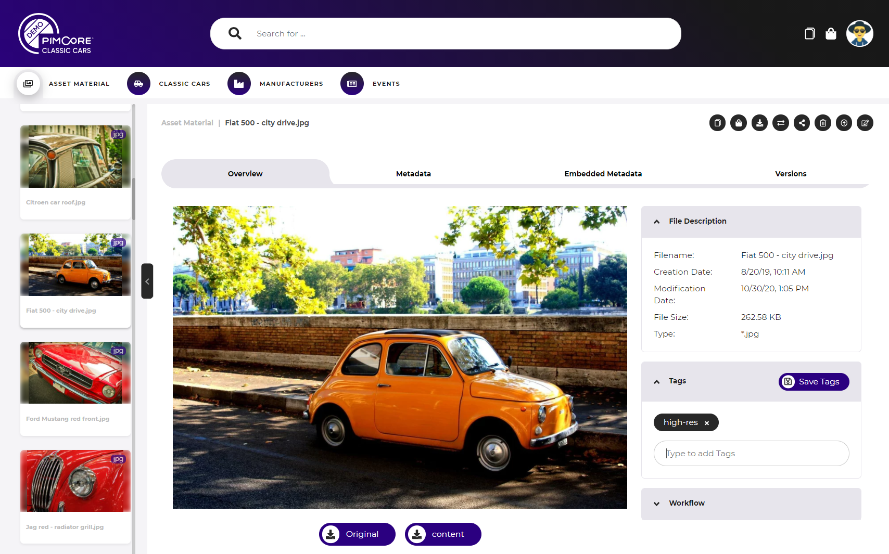
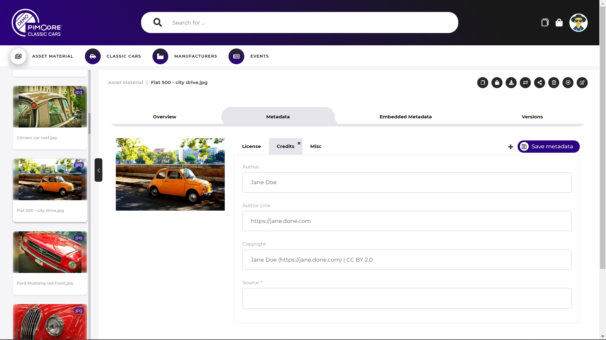
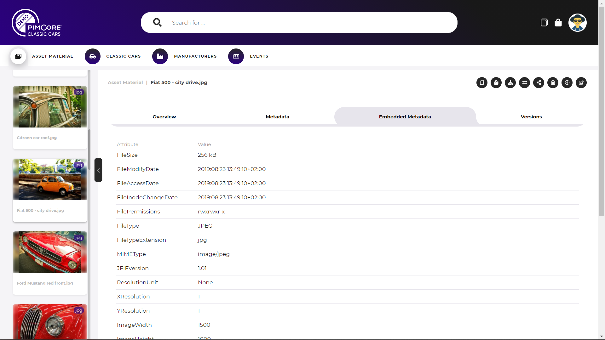
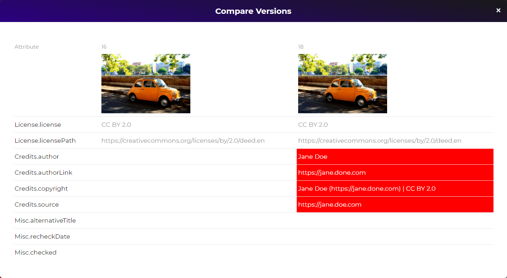
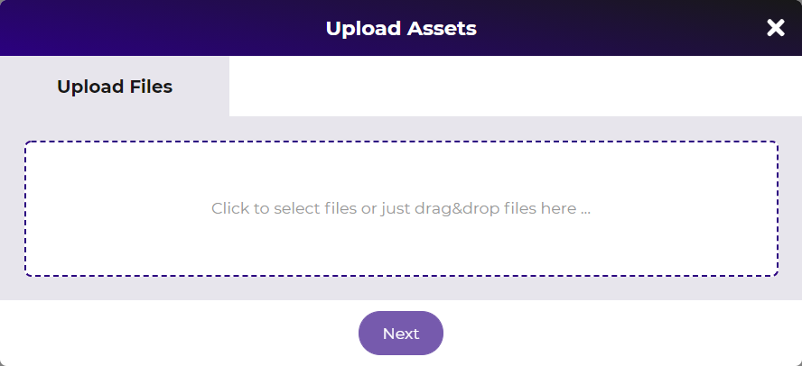
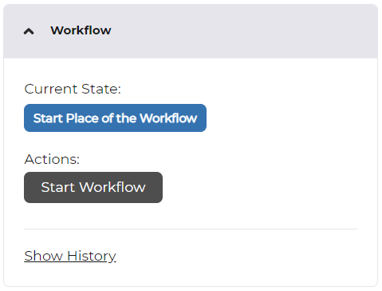

# Asset Detail Page

Asset detail pages are used for all asset data pools in the portals. The actual available 
features of the asset detail pages depend on the configuration of the asset data pool. 
See [asset pool configuration](../../05_Administration_of_Portals/05_Configuration/10_Data_Pool_Configurations/02_Asset_Data_Pools.md) 
for details. 

### Asset overview
The asset overview tab has following sections: 
- Preview of the asset: Shows a preview of the asset where possible. 
  - Images: Image preview and option to open it in light-box with zoom feature.
  - PDF & Documents: Preview of first page, possibility for changing pages by clicking forwards/backwards. 
  - Video: Preview of wallpaper of the video with inline player to start the video.
- General
  - Show configured attributes of asset metadata
  - Read-only
- File Description
  - Show system information of asset
- Tags
  - Show all tags assigned to asset based on Pimcore tags
  - If permissions sufficient possibility for modifying tags
- Workflow
  - see below

  
### Metadata display & edit

The metadata shows metadata based on enterprise metadata definitions. 
- Show and edit metadata based on asset class definitions
- Show each asset class definition in one tab (like Images, Product Assets)
- Allow adding additional asset class definitions to asset
- Allow editing of metadata attributes 
- Calculated values and relation attributes (many-to-one and many-to-many) are read-only

### Embedded Metadata

The embedded metadata tab shows all embedded metadata of the asset file like EXIF, XMP and IPTC. 

### Versions

The versions tab shows versions of asset as list with information like version date, note, etc.
In addition, it is possible to compare two versions with a side-by-side comparison 
and (re)publish oder versions of an asset. 

### Actions for Asset

##### Download asset
Download the current asset. The modal allows specifying download format for asset 
and metadata.
  
##### Add to Download Cart
Add the current asset to download cart. The modal allows specifying 
download format for asset and metadata. 
  
##### Add to Collections  
Add the current asset to a collection. The modal allows selecting an 
existing collection or create a new collection to add the element(s) to. 
See [collections](../05_General_Features/18_Collections/README.md) for details.

##### Public Share
Public share the current asset. 
See [public share](../05_General_Features/21_Public_Sharing.md) fore details.   

##### Delete
Delete the current asset.	

##### Move / Relocate	
Move the current asset to another folder. The modal allows selecting target folder 
to move the elements to. Only folders with corresponding permissions are selectable 
in the modal.  

##### Replace asset binary data
Replace the binary data of the current asset with a new version. Opens the upload 
dialog to upload the new file version.

##### Direct Edit
Open and edit the current asset with Pimcore Direct Edit feature. 
See [documentation](https://pimcore.com/docs/direct-edit/current) for details.

  
### Integration of Pimcore workflow engine
The asset detail page integrates the Pimcore workflow engine. It shows the current
workflow sate and provides buttons to execute the possible transitions. 

The history of workflow shows all workflow status updates including all comments. 

  
### Show Listing
The left frame shows other results of the result list the asset detail page was opened
from (if available). This can be a search result, a collection listing, a filtered
asset listing or a public share listing. 
It allows navigating forward and backward directly between asset detail pages. 

