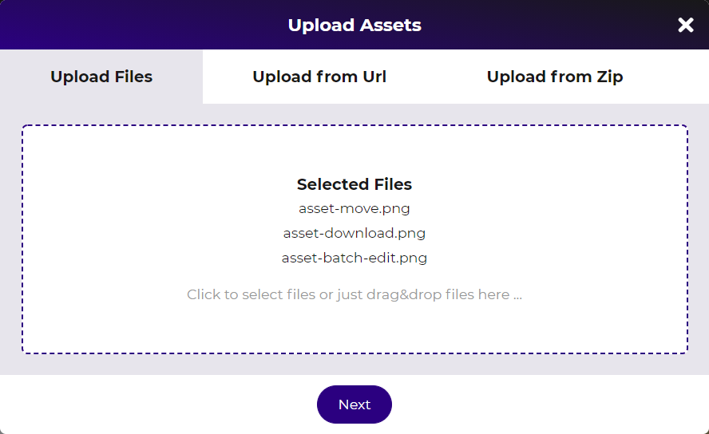
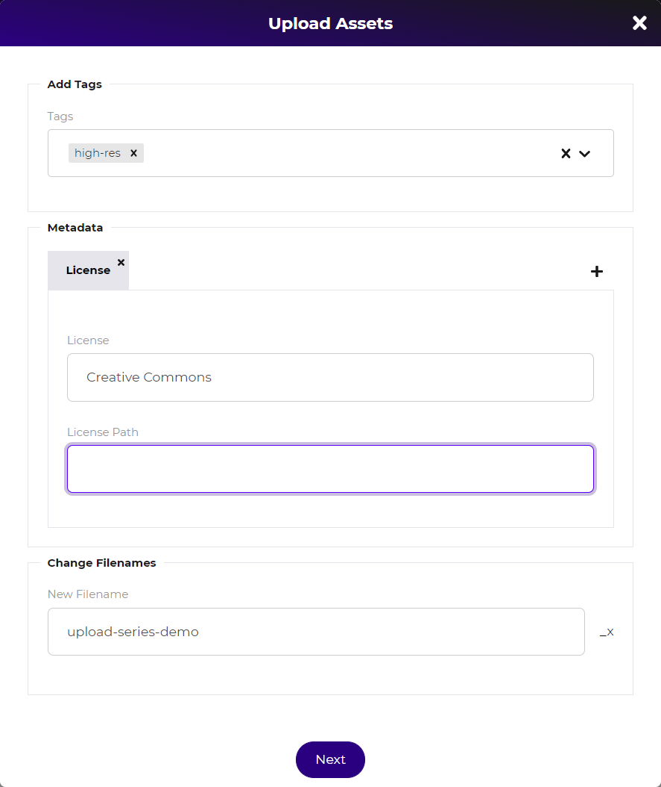
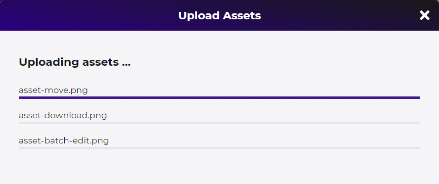
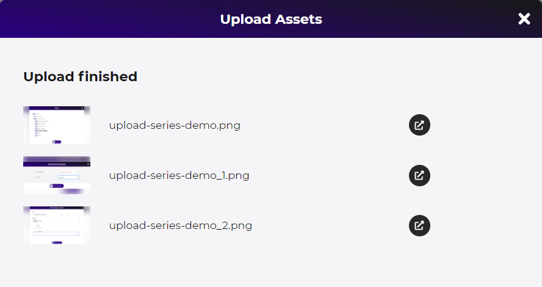

# Assets Upload Dialog

The upload dialog provides a multi-step wizard to upload new assets and enrich them 
with metadata right away during uploading. 

To upload assets into a folder, the user has to have upload permissions for the folder. 
This is possible either for any folder in the folder structure or for the dedicated 
[upload folder](./20_Upload_Folder.md) if configured for the data pool. 

### Starting Upload
To start the upload either drop files to the folder with upload permissions ...

... or click the upload button and drop or select files there. The upload dialog 
also supports uploading from a URL and uploading and extracting a ZIP archive. 

  
### Meta-data dialog 
The second step allows defining tags and metadata to be applied to the uploaded assets
as well as renaming the files based on a schema `<new-file-name>_x`. 
  

  

### File Upload
The third step is the actual upload of the files. 

### Upload Report
After finishing the upload, the upload report lists all uploaded files with links to
the detail pages and shows warnings and errors if any occurred during upload. 

