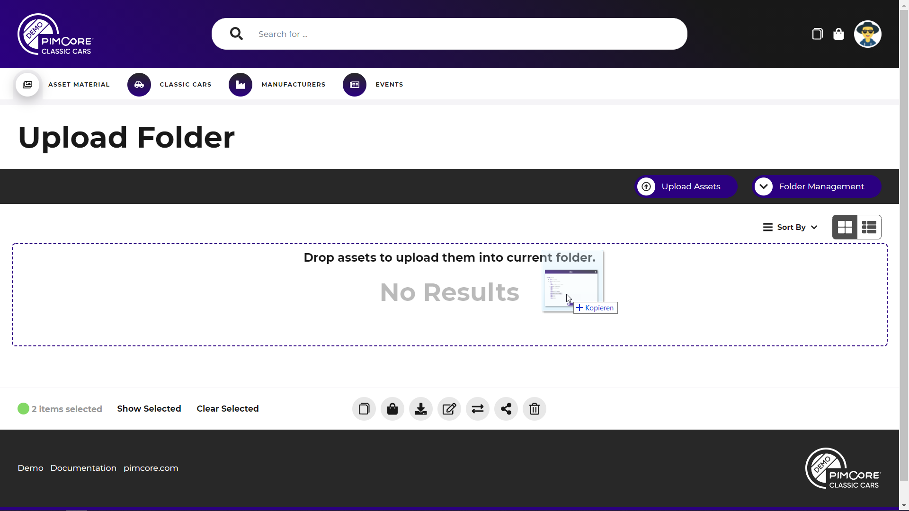

# Upload Folder

The dedicated upload folder is a special folder outside the data pool workspace that
allows uploading assets into a central place. 
A central difference to standard folders is, that users only see their own uploaded
files. Files uploaded from other users are not visible, unless the user has special 
permissions. 

The upload folder has always a flat structure, sub folders are not allowed. 

As soon as the data pool has an upload folder configured and the user has necessary
upload permissions, an upload folder button is visible in all grids. 

The upload itself works same as in any other folder by dropping files to the folder 
or selecting them via the upload dialog. 

##### Typical Process
A typical process that can be implemented with the upload folder might go as follows:
- Define an upload folder for the data pool.
- Multiple photographers can upload their images without seeing any files from the others.
- Reviewing users have all incoming files in one folder and can review, enrich and organize them
 into the final folder structure of the data pool workspace. 
 