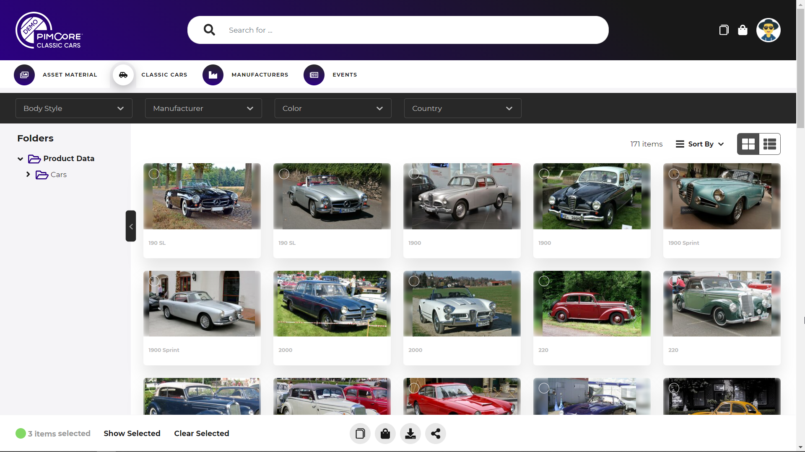
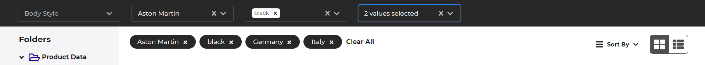
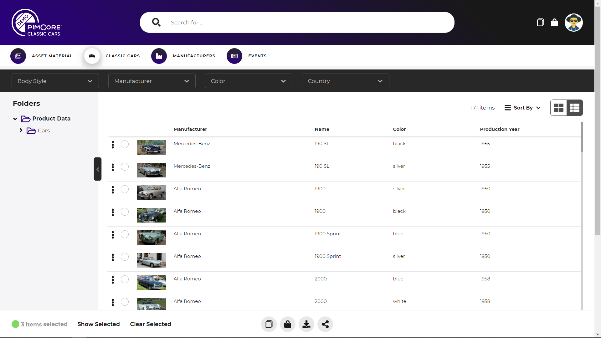
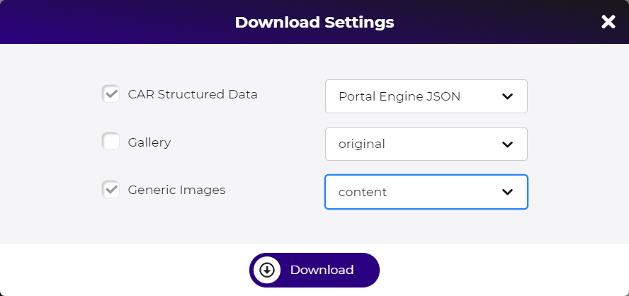

# Data Object Grid

Data Object grids are used for all data object data pools in the portals. The actual available 
features of the data object grid depend on the configuration of the data object data pool. 
See [data object pool configuration](../../05_Administration_of_Portals/05_Configuration/10_Data_Pool_Configurations/04_Object_Data_Pools.md) 
for details. 

### Navigation
The data object grid provides two options for navigating through the data objects: 
  
- **Navigation via Pimcore folder structure**: The folder tree is based on Pimcore folder 
  structure and depending on data pool workspace definition and user permissions. Clicking
  on a folder shows all elements located in this folder and any sub folders.  
- **Navigation via Pimcore tags**: The tag navigation is based on a sub tree of the Pimcore
  tags tree. The root tag for the tag navigation is defined via data pool configuration. 
  If user selects multiple tags, the result set contains all elements that have all selected 
  tags assigned.  

### Filtering
In addition to the navigation options, the data object grid also supports filters to further
filter the result set. The filters allow filtering based on system and data attributes 
of the data object and need to be configured. Single or multi select filter are available. 

### Views
The data object grid provides two views: 
- Grid-View: Shows big preview and name of the data object in a grid like view. 
- List-View: 
  - Shows only a small preview of the data object and additional attributes in a table like view. 
  - The attributes can be system and data attributes and need to be configured in 
    data pool configuration.  
  - Only available when attributes are configured in data pool configuration. 

### Element Actions

Each element of the grid provides depending on configuration and user permissions a couple 
of actions. The actions can be applied on single elements and a selection of elements. 

##### Add to Collection
Adds currently selected element(s) to a collection. The modal allows selecting an 
existing collection or create a new collection to add the element(s) to. 
See [collections](../05_General_Features/18_Collections/README.md) for details.

  
##### Add to Download Cart
Adds currently selected element(s) to download cart. The modal allows specifying 
download format for structured data and for each asset relation of the
data object if and in what format it should be included to the download cart item. 
See [download cart](../05_General_Features/15_Download_Cart.md) for details.

  

##### (Mass) Download
Directly download selected element(s). The modal allows specifying 
download format for structured data and for each asset relation of the
data object if and in what format it should be included to the download cart item. 
Depending on the amount of the downloaded elements, the action starts a background tasks 
for preparing the ZIP for downloading.  

##### Public Share
Public share selected element(s). 
See [public share](../05_General_Features/21_Public_Sharing.md) fore details.   
