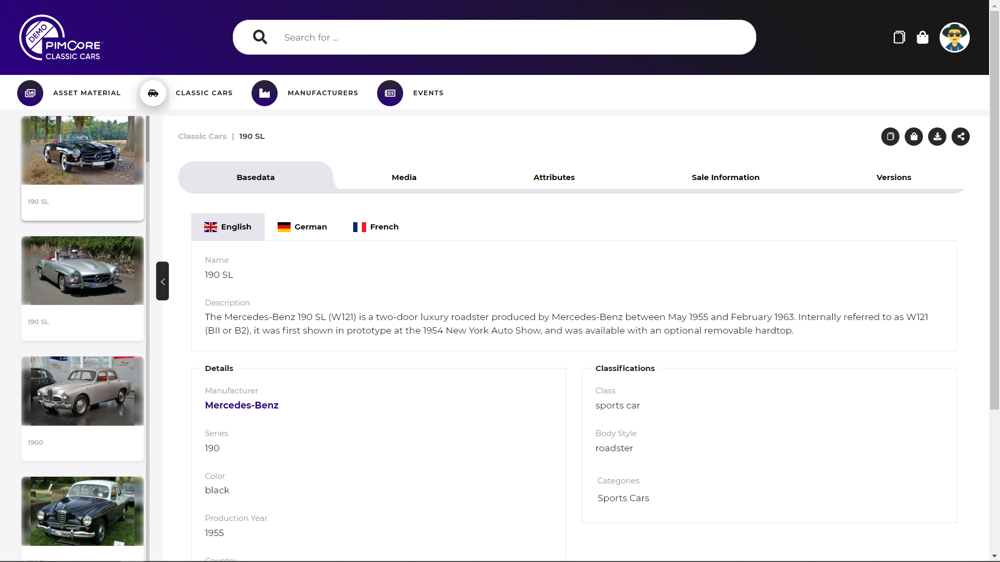
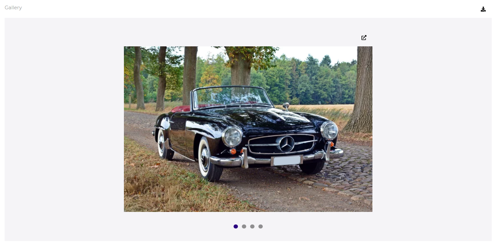
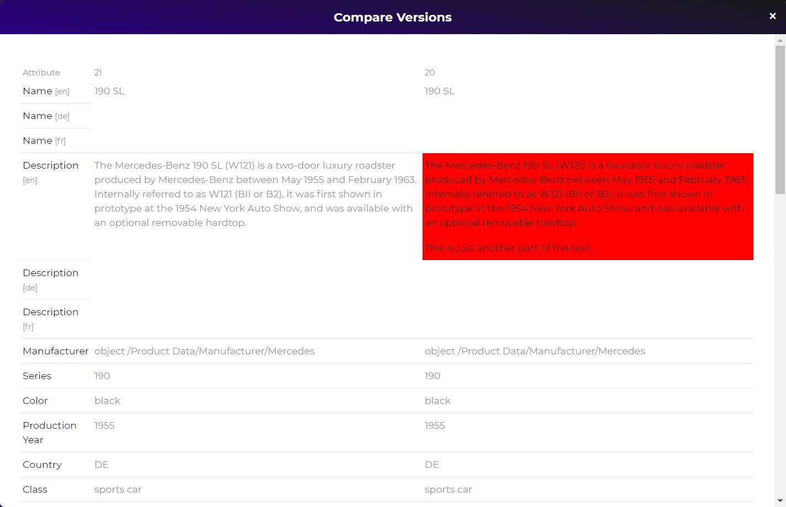

# Data Object Detail Page

Data object detail pages are used for all data object data pools in the portals. The actual available 
features of the data object detail pages depend on the configuration of the data object data pool. 
See [data object pool configuration](../../05_Administration_of_Portals/05_Configuration/10_Data_Pool_Configurations/04_Object_Data_Pools.md) 
for details. 

### Visualize Information
The main objective of the detail page is providing a read-only view to the data object data. The layout of the detail page
is based on a custom layout and can be configured. 

##### Link to other Data Objects or Assets
Relation fields to other data objects or assets print the name of the linked data object. If the linked element is also part of 
a data pool in the portal and accessible to the user, a link to its detail page is created. 

Media fields (like image, image gallery, video, etc.) directly show a preview of the linked asset, and offer a download option
as well as a link to the asset detail page if available in the portal. 

### Versions
Similar to the asset detail page, also the data object detail page shows the versions of the data object. Two versions 
can be compared in a side-by-side comparison.  

### Actions for Data Object

##### Download options for structured data and assets
Directly download the current data object. The modal allows specifying 
download format for structured data and for each asset relation of the
data object if and in what format it should be included to the download cart item. 
Depending on the amount of the downloaded elements, the action starts a background tasks 
for preparing the ZIP for downloading.  

##### Add to Download Cart
Adds current data object to the download cart. The modal allows specifying 
download format for structured data and for each asset relation of the
data object if and in what format it should be included to the download cart item. 
See [download cart](../05_General_Features/15_Download_Cart.md) for details.

##### Add to Collections
Adds current data object to a collection. The modal allows selecting an 
existing collection or create a new collection to add the element(s) to. 
See [collections](../05_General_Features/18_Collections/README.md) for details.

##### Public Share
Public share current data object. 
See [public share](../05_General_Features/21_Public_Sharing.md) fore details.   

### Show Listing
The left frame shows other results of the result list the data object detail page was opened
from (if available). This can be a search result, a collection listing, a filtered
asset listing or a public share listing. 
It allows navigating forward and backward directly between data object detail pages. 

  
    
