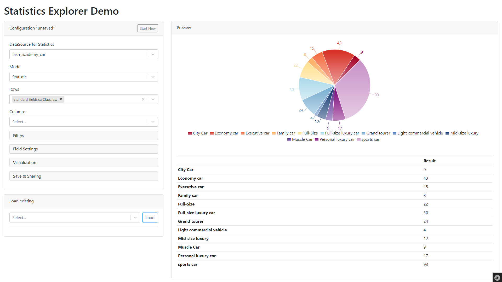

# Using Statistics Explorer

### Embedding Into Application

The statistics explorer is a react application that can be embedded into any 
template with following steps.
- **Include boostrap style sheets**: Statistics explorer is using bootstrap markup. To provide proper styling it 
  makes sense in include bootstrap style sheets
- **Include statistics explorer style sheets**: Include them via symfony webpack encore with `{{ encore_entry_link_tags('explorer', null, 'pimcoreStatisticsExplorer') }}`
- **Define statistics explorer markup node**: Add `<div id="statistics-explorer"></div>` to the template where the statistics explorer should be rendered into. 
- **Define URLs in `statisticsExplorerConfig`**: To tell statistics explorer which endpoints to use. The URLss 
  also implicitly define the context in which statistics explorer is executed (first URL part after prefix). Following
  URLs need to be defined. 
    - `dataSourceListUrl` : `/<PREFIX>/<CONTEXT>/data-sources`
    - `fieldsListUrl` : `/<PREFIX>/<CONTEXT>/field-collection`,
    - `resultDataUrl` : `/<PREFIX>/<CONTEXT>/data`,
    - `loadFieldSettingsUrl` : `/<PREFIX>/<CONTEXT>/field-settings`,
    - `loadConfigurationListUrl` : `/<PREFIX>/<CONTEXT>/load-configuration-list`,
    - `saveConfigurationUrl` : `/<PREFIX>/<CONTEXT>/save-configuration`,
    - `loadConfigurationUrl` : `/<PREFIX>/<CONTEXT>/load`,
    - `deleteConfigurationUrl` : `/<PREFIX>/<CONTEXT>/delete`,
    - `translationsUrl` : `/<PREFIX>/<CONTEXT>/translations`
- **Include statistics explorer scripts**: Include them via symfony webpack encore with `{{ encore_entry_script_tags('explorer', null, 'pimcoreStatisticsExplorer') }}`

A sample template could look like: 

```html 
<!DOCTYPE html>
<html lang="en">
<head>
    <meta charset="utf-8">
    <meta name="viewport" content="width=device-width, initial-scale=1, shrink-to-fit=no">

    <link
        rel="stylesheet"
        href="https://maxcdn.bootstrapcdn.com/bootstrap/4.5.0/css/bootstrap.min.css"
        integrity="sha384-9aIt2nRpC12Uk9gS9baDl411NQApFmC26EwAOH8WgZl5MYYxFfc+NcPb1dKGj7Sk"
        crossorigin="anonymous"
    />

    {{ encore_entry_link_tags('explorer', null, 'pimcoreStatisticsExplorer') }}

</head>

<body>

<div class="container-fluid">

    <h1 class="my-3">Statistics Explorer Demo</h1>
    <div id="statistics-explorer"></div>

</div>

<script type="text/javascript">
        statisticsExplorerConfig = {
            dataSourceListUrl: '/admin/stats/portal/data-sources',
            fieldsListUrl: '/admin/stats/portal/field-collection',
            resultDataUrl: '/admin/stats/portal/data',
            loadFieldSettingsUrl: '/admin/stats/portal/field-settings',
            loadConfigurationListUrl: '/admin/stats/portal/load-configuration-list',
            saveConfigurationUrl: '/admin/stats/portal/save-configuration',
            loadConfigurationUrl: '/admin/stats/portal/load',
            deleteConfigurationUrl: '/admin/stats/portal/delete',
            translationsUrl: '/admin/stats/portal/translations'
        }
</script>

{{ encore_entry_script_tags('explorer', null, 'pimcoreStatisticsExplorer') }}

</body>
</html>
```

Of course, it is also possible to directly embed it into an existing react application.
See [explorer.js](https://github.com/pimcore/statistics-explorer/blob/master/assets/js/explorer.js) for details.  


### Exploring Data

<div class="image-as-lightbox"></div>



##### Select Data Source
First step when exploring is to select a data source. For more information how to
define data sources see [Installation and Configuration](./01_Installation_and_Configuration.md). 

##### Select Statistics Mode
The statistics explorer supports two different modes: 
- *Statistic*: Standard mode that calculates statistics based on defined metrics and also 
  builds pivot tables when rows and columns are defined. 
- *List*: Simple list of data with defined columns. 

##### Select Rows and Columns
Depending on the statistics mode either rows and columns or just columns can be defined.
Which rows and columns are available is defined by the data source. 

##### Define Field Settings
As soon as rows and/or columns are selected, field settings for can be defined for them. 
The available settings depend on data source type, field type and position of the field 
(row/column/first/last), and should be self explaining.

##### Define Filters
As soon as data source is selected, filters can be defined. These are applied to the 
query before the statistics are calculated. Available fields and operators depend on
data source type and field type and should be self explaining. 

##### Select Visualization
In *Statistic* mode, data also can be visualized with simple charts. For the charts
same data is used as shown in table. Following chart types are supported: 
- Line Chart
- Bar Chart
- Area Chart
- Pie Chart


##### Save & Load & Share
Configurations can be saved and loaded later on. They also can be shared with other users
or user roles. 

If a user is not owner of a configuration, changes only can be saved as a new copy of the 
configuration (which then can be shared again). The user cannot overwrite the original configuration. 

The configurations are stored in database. 

Besides `own` and `shared` configurations, there also can be `global` configurations. 
For details see [Providing Predefined Statistic Configurations](../05_Further_Customizing/08_Providing_Predefined_Statistic_Configuration.md).   
